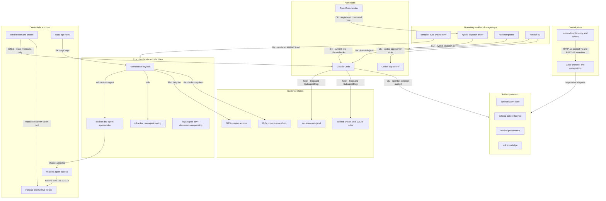
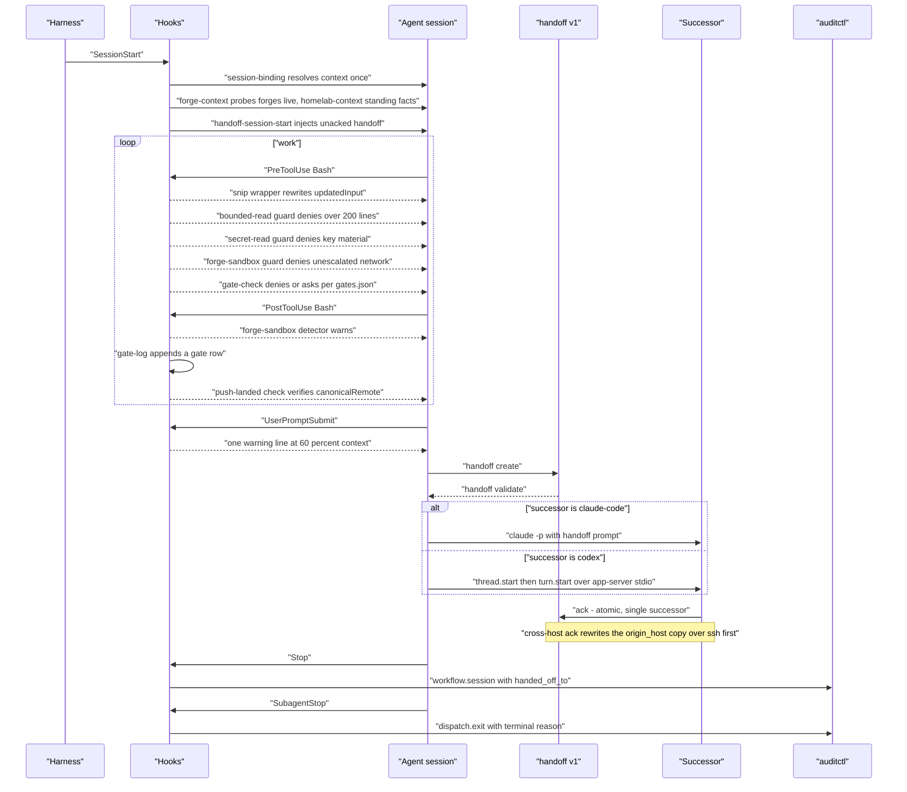
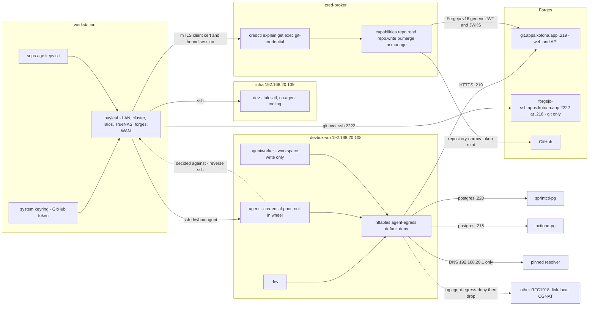

# The agentic estate

Status: ratified record of the estate as of 2026-09-12; supersedes portable-execution.md:21
ownership block; verify against the artifact before relying on any line.

## 1. Purpose and how to read it

The stable whole-system record of the agentic estate around the Vuoro substrate: control plane,
authority owners, operating workbench, execution hosts and identities, harnesses, the credential
and trust boundary, and the evidence stores. It exists because the estate's shape was previously
recoverable only by reading ten repositories and four partly contradictory ownership tables. It
is a record, not a plan: it states what was true at the artifact on 2026-09-12, schedules
nothing, and grants no authority.

**Marking**, as used by the two surveys it is compiled from: **[doc]** = read from a file, so the
file is the evidence and the running system may differ; **[obs]** = measured live on the
workstation on 2026-09-12, a point in time that may have expired. Unmarked facts are structural,
synthesised from both surveys and traceable to the citations given.

**Where the status authority lives.** Component *status* is not settled here.
`docs/direction/disposition-register.yaml` (v2, 2026-09-01) is the portfolio status authority,
`disposition-corrections.md` its companion; the closed `status_vocabulary` is at register lines
18–40, `verdict_vocabulary` at 41–50 (survey-control-plane.md:7): `active / keep-narrow / promote
/ hold / frozen / deferred / spec-only / retired / unknown`. Where this record and the register
disagree, the register decides status and this record decides shape.

**Sources.** `survey-control-plane.md` (165 lines) and `survey-execution-layer.md` (111 lines),
both compiled 2026-09-12; citations of that form point into them, while `AGENTS.md:N` or
`hosts/devbox/default.nix:N` cite the artifacts those surveys verified. Reading order: §2 shape,
§3 ownership, §4 session, §5 reach, §6 evidence, §7 economy, §8 deltas, §9 pointers.

## 2. Layered whole-system shape

Redrawn from `agentops/docs/architecture/vuoro-system-shape.md:16-40`, named by the control-plane
survey as the best current whole-system picture and explicitly a **target**, not a shipped claim
(survey-control-plane.md:133). The figure replaces that target with the 2026-09-12 facts and adds
the execution, identity, trust and evidence layers it omitted; edges carry their transport.

The **control plane** is contract and routing authority, not state authority: Vuoro owns
`operation-catalog/v1`, `invocation/v1`, `invocation-result/v1` and `resource-reference/v1` and
holds no store of its own (survey-control-plane.md:15,17); vuoro-cloud owns `/api/control/v1`,
`/api/connect/v1`, the control DB and the Ed25519 minting (survey-control-plane.md:29-31). Each
**authority owner** holds one state machine and one store (§3). The **workbench** is agentops,
which owns no work, action or knowledge authority (register:185-187). **Hosts** are asymmetric by
design — `hosts/infra/default.nix:15-19` records that cluster-reaching credentials live on infra
*precisely because agents cannot execute here*. **Harnesses** are interchangeable at the
lifecycle-adapter level and hook absence never grants authority (`lifecycle-adapters.v1.json`).
**Evidence stores** fall into the four durability classes assigned in §6.3.

## 3. Ownership

The synthesis at survey-control-plane.md:111-127, and the ownership table of record for the
estate.

| Concern | Authoritative owner | Store | Not |
|---|---|---|---|
| Work state, readiness, dependencies, reservations | sprintctl | SQLite / served PostgreSQL | not actionq, not vuoro |
| Action lifecycle, claims, leases, terminal settlement | actionq | PostgreSQL `actions`+`events`; CAS | not vuoro, not the dispatcher |
| Findings, observations, receipts, evidence events | auditctl | SQLite index + NDJSON shards; optional central `audit` | never desired state |
| Curated knowledge and decisions | kctl | SQLite; committed markdown | not served |
| Credentials / identity | vuoro-cloud tokens, membership, Ed25519 minting + cred-broker repo-scoped authorization | control DB, k8s Secrets | not vuoro, not the runner |
| Session evidence — transcripts, exit facts, cost | harness hooks → auditctl `workflow.session` / `dispatch.exit`; NAS archive | NDJSON + archive | not actionq |
| Session memory across a handoff | agentops `handoff/v1` | `agentops/docs/dispatch/handoffs/*.json` | not sprintctl — bundle by digest |
| Push, PR creation, promotion | trusted publisher identity | Git remote | never runner / worker / Vuoro |
| Transport, catalog, schema compatibility, composition | vuoro | none | never domain authority |
| Hosting, tenancy, onboarding | vuoro-cloud | control DB + outbox | no work / action authority |
| Deployment substrate | appservice — Flux/Talos | git manifests | — |

### 3.1 What Vuoro is explicitly not authoritative for

From `integration-topology.md:36-39` and `portable-execution.md:40-42`, via
survey-control-plane.md:21. Vuoro does not hold: push authority to a governed repository; the
naming of integration branches; selection of verification profiles; the promotion decision;
execution; Sprintctl planning semantics; ActionQ lifecycle interpretation; raw-output storage; a
generic jobs subsystem; workspace or tenant authority. The trusted publisher is not the runner,
not the worker and not Vuoro; it is the only identity holding write credentials to a governed
repository (`integration-topology.md:32-34`).

### 3.2 Ownership tables this record reconciles

Four ownership statements predate this record (survey-control-plane.md:129).
`/projects/dev/AGENTS.md:372-380` is the storage and durability view with its 2026-08-29
corrections — live, restated in §6.3. `integration-topology.md:14-30` is the
publication-authority stack — live, restated by the push-authority row above.
`agentops/docs/contracts/session-resolved-context.md:155-162` is session identity attribution —
live, scoped to session writes. `portable-execution.md:21-38` is historical, still names outctl,
and is **superseded by §3 of this record**.

## 4. Session lifecycle

The observed Claude Code session shape on the workstation, from the hook inventory
(survey-execution-layer.md:26-49), the handoff contract (survey-control-plane.md:110) and the
context-economy controls (survey-execution-layer.md:95-107).

### 4.1 Gate semantics in the loop

- `snip-hook-defer.sh` wraps `snip hook`, keeps `updatedInput` and **strips** the decision,
  because snip's own hook answers `permissionDecision: "allow"` for every matched command,
  bypassing the permission classifier for `git push` and `kubectl delete`; an explicit `"defer"`
  was observed to leave subagent Bash calls without a result. Fails open by design
  (survey-execution-layer.md:103).
- `bounded-read-guard.sh` is the only deny in the **tracked** project settings; escape hatch
  `BOUNDED_READ_APPROVED=1`. Its own plan calls it *a guardrail against HABIT, not a control*
  (survey-execution-layer.md:105).
- `secret-read-guard.sh` is a **local, untracked** file and fails **closed** without `jq`;
  `forge-sandbox-detector.sh` — not the guard — is the **primary** defence against un-escalated
  network calls; and `handoff-context-threshold.sh` warns once at 60% and is *deliberately not a
  stop* (survey-execution-layer.md:31,34,44).

### 4.2 Handoff contract

`handoff/v1`, schema `agentops/schemas/handoff.schema.json`, `additionalProperties: false`.
Required: `handoff_id, version, predecessor, objective, constraints, decisions, rejected, state,
unresolved, evidence, sprintctl_bundle_ref, next_action, successor`; optional `origin_host` /
`origin_path`; `successor.harness` is `claude-code | codex`. State digest v1 is `sha256(git diff
HEAD ‖ git status --porcelain)`; v2 adds, per untracked file, `NUL path NUL sha256(contents)`,
and `state.digest_version` declares which. CLI `agentops handoff
create|validate|prompt|ack|render` over `templates/dispatch/scripts/handoff.py`; the Codex path
`handoff_codex.py` drives `codex app-server --stdio` as newline-delimited JSON-RPC 2.0 with no
daemon, and because `thread/read` over turns is unsupported on codex 0.153.4, `read` parses the
rollout file. Canonical store `agentops/docs/dispatch/handoffs/<date>-<slug>.v<N>.json`, `.md`
regenerated. Ack is atomic and admits a single successor; on a non-origin host it performs the
atomic ack on the **origin** copy over ssh first, since `origin_host` travels with the file.
Enforced successor isolation **was** executed on 2026-09-12 — Runs E and F, successor as
`agent@devbox` with `/home/bayleaf` absent, agentops commit `9974beb` — and only the cross-host
ack write-back is untested, by decision (survey-control-plane.md:3,110;
survey-execution-layer.md:61,107).

## 5. Trust and reach

### 5.1 Hosts and identities

| Host | Identities | Reach | Nix entry |
|---|---|---|---|
| workstation | `bayleaf` | LAN, cluster, Talos, TrueNAS, forges, WAN | `gitops-nixos/hosts/workstation/default.nix` |
| devbox-vm `192.168.20.108` | `dev`, `agent`, `agentworker` | egress default-deny plus three LAN /32s | `gitops-nixos/hosts/devbox/default.nix` |
| infra `192.168.20.109` | `dev` | Talos API, gitops maintenance, **no agent tooling** | `gitops-nixos/hosts/infra/default.nix` |
| legacy pod `vscode-shell-…` | `dev` | in-cluster, all cluster tools | appservice `clusters/main/kubernetes/apps/vscode-shell` |

(survey-execution-layer.md:5-10.) `/projects/dev` is a *different* filesystem per environment:
workstation local Btrfs canonical, devbox local zvol clones on `agentpool/projects` and
**independent**, legacy pod a TrueNAS PVC subPath (`AGENTS.md:14-30`). A pull or `uv tool
install` on the workstation does nothing for devbox-vm, and untracked files never propagate.
Detection is `$USER` = `agent` on devbox-vm and `dev` in the pod, with
`$WORKSPACE_ROOT=/workspace/dev` only in the pod (`AGENTS.md:32-44`).

### 5.2 Egress allowlist

`modules/system/agent-egress.nix` calls itself *the host-level backstop that removes lateral LAN
reach — Talos API, TrueNAS, OPNsense UI — even if the perimeter rule set regresses*. Rules accept
loopback, established and DHCP; allow DNS only to `dns_allow` and drop 53/853 otherwise; accept
`lan_allow`; then `log prefix "agent-egress-deny" counter drop` for all other RFC1918, link-local
and CGNAT, accepting WAN so OPNsense decides. The devbox instance
(`hosts/devbox/default.nix:125-138`) pins DNS to `192.168.20.1` and allows exactly three
destinations: `.219` Forgejo, `.220` sprintctl-pg, `.215` actionq-pg. Reinforced by IPv6 RA off,
resolved fallbacks cleared, TCP 22 only, key-only sshd (survey-execution-layer.md:75).

### 5.3 Sandbox escalation contract

`AGENTS.md:107-147`: every network call is sandboxed unless escalated, across `gh`, `fj`, `curl`,
`wget`, `hcloud`, `kubectl` and `git push|fetch|pull|clone|ls-remote`, under any harness. **The
signature of a sandboxed call is exit 0 with empty output** — a success shape, not an error
shape, which is why the PostToolUse detector rather than the PreToolUse guard is the primary
defence. `AGENTS.md:126-131` separates *sandbox escalation*, which the agent performs
autonomously and which never prompts, from *operator handoff* and from *gated operation*.
PreToolUse deny is honoured **[obs]**: the guard fired and blocked a command during the survey
session (survey-execution-layer.md:71,89).

### 5.4 cred-broker

Capabilities are the policy primitives; provider credentials are *delivery artifacts, never
policy primitives*. The set is `repo.read`, `repo.write`, `pr.merge`, `pr.manage`; `repo.write`
covers **both** forges, so it must be kept repository-narrow. Sessions bind to an **mTLS
certificate fingerprint** with only the token hash persisted; SQLite receipts cannot store
credential values; OpenBao Transit signing keys are never exported; listeners split into public
health/OIDC and a TLS 1.3 API requiring client cert plus bound session. **Live adapters remain
disabled pending commissioning.** `credctl get` prints only lease metadata, and `credctl` lives
in the system profile because `ff-merge-pr.sh` does a bare `command -v`; **[obs]**
`cred-broker-identity.timer` is a systemd **user** unit on a 10-minute period (survey-execution-layer.md:65).

### 5.5 Forge endpoints

`https://git.apps.kotona.app` (192.168.20.219, Forgejo 16.0.3) serves web and API;
`forgejo-ssh.apps.kotona.app:2222` (192.168.20.218) is Git-over-SSH **only**; there is no
`forgejo.apps.kotona.app`. Private repos answer unauthenticated calls with *The target couldn't
be found* — a 401 wearing a 404's clothes. `fj` needs `-H git.apps.kotona.app` and `EDITOR`; `fj
pr search` returns 410 Gone; fast-forward-only merges need the REST API with
`{"Do":"fast-forward-only"}`. `git config claude.canonicalRemote` is canonical, **not** `origin`
(`AGENTS.md:148-168`).

### 5.6 The reverse-ssh decision

A reverse ssh path from devbox back to the workstation was considered for cross-host handoff ack
and **rejected**; instead `origin_host` travels inside the handoff file and the ack happens on
the origin copy from the host with forward reach. That keeps devbox's allowlist at three LAN
destinations and preserves the containment argument in `hybrid-dispatch/claude-settings.json`:
*Containment here is the identity and the network boundary, not interactive confirmation. Do NOT
copy this file to an identity that holds real credentials.* That devbox harness runs
`defaultMode: bypassPermissions` with four hooks only — snip wrapper, cost, subagent-exit,
session-binding — and **none** of the guards, against an agentops contract pinned at `b717429`,
so *the agents running on devbox get the pinned contract, not the ability to change what is
pinned* (survey-execution-layer.md:51,107).

## 6. Evidence and reference formats

### 6.1 auditctl

Enforced ref prefixes (`auditctl/validation.py:10`, enforced at `:137-139`): `wi:` work item,
`ka:` knowledge artifact, `ad:` audit event, `sha:` commit, `pr:`, `sprint:`, `capsule:`,
`baseline:`. Event ids are `ad:<26-char Crockford ULID>`, matched by `^ad:[0-9A-HJKMNP-
TV-Z]{26}$`. Digests take two forms, `sha256:<64 hex>` and `artifact:sha256:<64 hex>`, the latter
the most common ref form on disk. Producer envelope, 13 fields: `event_id, schema_version,
record_class, origin_stream_id, origin_seq, event_type, runtime_session_id, occurred_at,
basis_revision, correlation_id, causation_id, payload, payload_sha256`; `record_class ∈
{observation, decision}`; optional `resolved_context {repo_id, repo_root, artifacts_root,
published_from, resolution_source}` plus `stream_class`. Write protocol: NDJSON fsync **before**
the SQLite commit. Observed across 2,367 events **[obs]**: `workflow.session` 1086,
`dispatch.exit` 1049, `knowledge.landed` 88, `session.binding` 29, `workflow.escalation` 15,
`dispatch.packet.reviewed` 13, `sprint.closed` 9, `workflow.friction` 7, `harness.gate` 6, long
tail; sources `claude-hook` 2162, `sprintctl` 102, `codex` 22, `luna-coordinator` 14,
`metanarrative-planner` 12, `manual` 11, `hybrid-dispatch` 5, `git-hook` 2
(survey-control-plane.md:75,77,139).

### 6.2 Other reference vocabularies

| Producer | Form |
|---|---|
| handoff evidence kinds | `evidence[].kind ∈ {session, artifact, auditctl, sprintctl}` |
| handoff id / bundle ref | `<date>-<slug>.v<N>`; `sprintctl_bundle_ref = {path, sha256, generated_at}`, by digest, never by copy |
| sprintctl ref types | `pr, issue, doc, other, file, glob, manifest, command` |
| actionq | attempt `aqs:attempt-<n>`; principal `<issuer>:<subject>:<epoch>`; event `actionq:event:<row>`; producer prefixes `agent: script: human: worker: doc:` |
| vuoro | `resource-reference/v1 {owner, resource_kind, reference, revision}` |
| doc refs and branches | `<label>@git:<sha>`; envelope `base: git:<sha>`; `integration/<plan-id>/<integration-id>` |
| capability labels | `harness:opencode`, `runtime:python-3.12`, `isolation:disposable-checkout` |

(survey-control-plane.md:57,110,139.) The shared terminal reason vocabulary used by both actionq
`stop_reason` and the auditctl `dispatch.exit` projection is `completed, process-exit,
start-failed, cancelled, timeout, usage-limit, crash-inferred` (`auditctl/validation.py:22-38`);
actionq's `terminal_status` is the separate enum `{completed, no_change, blocked, failed,
budget_exhausted}` (survey-control-plane.md:47).

### 6.3 Durability classes

The required vocabulary is `session-local | host-persistent | cross-host-replicated |
durable-authoritative` (`AGENTS.md:432-441`).

| Store | Class | Note |
|---|---|---|
| Harness transcript spool `~/.claude/projects/<cwd>/<uuid>.jsonl` plus `tool-results/` | session-local | **[obs]** transcript plus a spool directory with `subagents/` |
| `.claude/state/gates-<session>.jsonl` | session-local | drained by the Stop hook |
| `.claude/state/session-bindings/` | host-persistent | written once per session by `session-binding.sh` |
| `/projects/dev/.claude/session-costs.jsonl` | host-persistent | **[obs] 2,344 rows**; each host writes its own copy |
| Btrfs `/projects-snapshots` | host-persistent | read-only, `daily 7`, `weekly 4`; **[obs]** timers active |
| NAS archive `/mnt/truenas/.../claude-sessions` | cross-host-replicated | daily `sessions.tar.gz` + `index.tsv` + sha256, staged `.partial` then `mv`; **[obs]** one tree `2026-09-12T095556Z`, 225 sessions |
| auditctl shards `_artifacts/<repo>/audit/events-YYYY-MM-DD.ndjson` + SQLite index | durable-authoritative | append-only; `check_append_only_shards.py` refuses commits that rewrite shard lines |
| sprintctl SQLite / served PostgreSQL | durable-authoritative | source-of-truth order live state > `usage --context` / `handoff` > committed `render` > docs |
| actionq PostgreSQL `actions`+`events`, CAS at `ACTIONQ_ARTIFACT_ROOT` | durable-authoritative | CAS holds one object |
| kctl SQLite plus committed markdown | durable-authoritative | durability *is* `kctl render` into committed markdown; kctl is **not** served |
| auditctl central `audit` PostgreSQL schema | intended durable-authoritative only | holds **zero rows**; no submit path — *the gap is a client, not a deployment* |

Per-repo audit correctness depends on `export AUDITCTL_ARTIFACTS_ROOT="$PWD"` in a **tracked**
`.envrc`, present in agentops and vuoro since 2026-08-29. Anything crossing a host boundary
carries the transfer contract (`AGENTS.md:443-457`): `source_host`, absolute `source_path`,
`classification`, `created_at`, basis, `durable_refs`, a SHA-256 inventory, `replicas`, retention
— *rsync success is evidence of transfer, not evidence of identity*
(survey-execution-layer.md:93,107).

### 6.4 The cost-log supersede rule

`session-costs.jsonl` fields: `ts, project, session, runtime_session_id, host, model, in,
cache_write, cache_read, out, cost_usd, turns, assistant_msgs, tool_calls, duration_s`, mirrored
to auditctl as `workflow.session` with gate outcomes and `rework_rounds`. **Rows supersede; they
do not accumulate.** Stop fires per assistant turn and each row is cumulative for that session,
so summing over-counts quadratically — $56,485 summed against $3,825 actual across 97 sessions
(`AGENTS.md:296-339`). Every consumer must reduce to the newest row per session, as
`cost-summary.sh` does (survey-execution-layer.md:91).

## 7. Context economy

The governing plan is `/projects/dev/outctl/docs/CONTEXT_ECONOMY_PLAN_2026-09-12.md`, retained
despite outctl's `retired` status because the measurement outlives the tool. Baselines from
`outctl/docs/REASSESSMENT_2026-09-12.md` over 220 transcripts: Bash results are **38%** of
top-level session content and 86% of tool results; **60%** of those bytes are file reads, 18%
git, 13% infra; per-result size p50 **768 B**, p99 13 KB, max **29 KB**; 242 of 8,523 results
exceed 10 KB, and the harness spools anything over 30 KB natively. The diagnosed cause is the
auto-mode `bashFirst` steer (survey-control-plane.md:117; survey-execution-layer.md:97).

| Control | Mechanism | Gate |
|---|---|---|
| `snip` | nixpkgs 0.24.1 via `modules/system/snip.nix`; one filter source linked per identity **file by file**; `config.toml` disables the tee buffer, which would otherwise keep raw output of every failed command — including sops-decrypted material — on disk. Filters: flux, talosctl, journalctl, nix build/eval, sops. Bypass `snip proxy -- <cmd>`, `snip -v`, `snip gain`. **[obs]** 8 filters on devbox | phase 1 **measuring** — git+infra+tests share of Bash bytes drops ≥40% with no lost failure line over 10 sessions |
| snip wrapper | `snip-hook-defer.sh`, see §4.1 | correctness fix, no gate |
| Bounded reads | `CLAUDE.md:5-12` overrides the auto-mode file-reading reminder: `grep -n` then `sed -n`/`head`/`tail`, or Read `offset`+`limit` above ~80 lines; never `cat`/`bat`/`sed -n '1,$p'`; the hook denies above 200 lines with a `BOUNDED_READ_APPROVED=1` escape; 34 tests | phase 2 **measuring** — file-read share <45%, Bash share <28% |
| Delegation norm | above ~200 lines or many files, the work goes to an Explore subagent | folded into phase 2 |
| Handoff | 60% warning, `/handoff` skill at `.claude/skills/handoff/SKILL.md`, machinery in agentops | phase 3 **done**, gate passed at `1c5f8ac`; phase 4 **done** — Codex half `b6b60dc`, enforced isolation `9974beb` — write-back untested by decision |
| Session archive | phase 0 | **done**, 225 sessions archived |
| — | phase 5 | **deferred** |

Rejected and recorded so they are not re-proposed: Context Mode, rewrite-based truncation,
revival of outctl's projection layer, and running two rewriting hooks at once. The session-start
hook is the only seam for an *interactive* successor, because `initialUserMessage` is a `claude
-p` facility only (survey-execution-layer.md:107).

## 8. Known gaps and doc-vs-disk deltas

Each row is a real disagreement between a document and the disk as of 2026-09-12. Owner is the
repository that must change; fix shape is the smallest correct change, not a schedule.

| # | Gap | Evidence | Owner | Fix shape |
|---|---|---|---|---|
| 1 | Deny-capable guards are registered only in the **untracked** workstation `settings.local.json` and are absent from the devbox agent settings. A new host or fresh clone gets telemetry and snip, not the guards. | survey-execution-layer.md:109 | `/projects/dev` + gitops-nixos | promote `secret-read-guard.sh`, `forge-sandbox-guard.sh`, `gate-check.sh` into the tracked project `settings.json`, and into `hybrid-dispatch/claude-settings.json` if the containment argument permits |
| 2 | `AGENTS.md:45` gives actionq-pg as `192.168.20.216`; `hosts/devbox/default.nix:137` allowlists `192.168.20.215`. The nftables set is authoritative for reach. | survey-execution-layer.md:111 | `/projects/dev/AGENTS.md` | correct AGENTS.md to `.215` |
| 3 | ActionQ's execution plane, decided deleted 2026-08-20, is still on disk: `application_enqueue`, `application_claim`, `application_dispatch`, `managed_dispatch`, `runner_auth`. | survey-control-plane.md:49,161 | actionq | execute `docs/plans/2026-08-20-execution-plane-deletion-order.md` |
| 4 | The served audit substrate holds **zero rows** — the CLI has no submit path. | survey-execution-layer.md:93; survey-control-plane.md:163 | auditctl | add a submit client, or record the served substrate as spec-only |
| 5 | `session-costs.jsonl` has **two writers**, the workstation hook and the devbox `hybrid-dispatch/claude-settings.json`, and history carries no `host` field, so per-host cost is unrecoverable. | survey-control-plane.md:104,163 | agentops + gitops-nixos | the field exists in the current schema; backfill is impossible, so record the cut-over date |
| 6 | agentops skills fan-out is broken: vuoro and sprintctl drifted; actionq, auditctl and kctl have no `.agents/skills` at all. | register:203-208, via survey-control-plane.md:102 | agentops | re-run `sync_skills.py` and gate it |
| 7 | Harness audit hooks write `.auditctl/` and `_artifacts/` **inside the repo under test**, so a handoff whose repo is the successor's cwd cannot validate — the state digest moves under it. | survey-execution-layer.md:107 | agentops | resolve the artifacts root outside the repo under test, or exclude hook-written paths from the digest |
| 8 | Stale `_projects` member worktrees still contain `outctl`: both `vuoro-dispatch-ready` and `vuoro-outctl-ready` are 8-member and predate outctl's removal from `agentops/project.toml`, now 7, and `vuoro-outctl-ready`'s `project.context.json` points at a vanished `/tmp/outctl-materialize/...` path. | survey-control-plane.md:113-115 | agentops | re-materialize both folders, or retire `vuoro-outctl-ready` |
| 9 | The register lists vuoro-cloud as `hold`; it is not paused — HEAD `f6d2c42` dated 2026-09-12, heavy activity — though its waking condition, emitting a Sprintctl `served_profile`, is genuinely still unmet. | survey-control-plane.md:33,159 | vuoro `disposition-register.yaml` | correct the status or restate the gate; only the owner may release a `hold` |
| 10 | `portable-execution.md:3-13` self-declares superseded as a plan on 2026-08-20, deferring to `docs/plans/2026-08-20-execution-federation-alignment.md`, yet remains live vocabulary and is still cited from README:87. | survey-control-plane.md:23,161 | vuoro | this record supersedes its `:21` ownership block; the rest stays as historical vocabulary with its banner intact |
| 11 | `hcloud` appears in the sandbox escalation list at `AGENTS.md:110` but is **not on the workstation PATH**. | survey-execution-layer.md:69,113 | `/projects/dev/AGENTS.md` | install it or drop it; an escalation rule for an absent binary is dead text |

Recorded without an action: auditctl's `record_class` and `stream_class` landed **after** the
register was written, and sprintctl's checked-in root `handoff*.json` files are pre-0.3.0 and do
not match the current bundle shape (both survey-control-plane.md:157); `AGENTS.md:53-70` still
treats the legacy pod as first-class though it is pending decommission
(survey-execution-layer.md:111). Two survey claims are themselves void: handoff successor
isolation is **enforced** on devbox, retiring survey item 14.7 (survey-control-plane.md:3), and
`forge-sandbox-guard.sh:5-6` calls PreToolUse deny UNVERIFIED when **[obs]** it fired and blocked
a command during the survey session (survey-execution-layer.md:109).

## 9. Pointers

The authoritative document per component. Where a component's own docs disagree with this record
on *shape*, this record is later; on *status*, the disposition register decides.

| Component | Authoritative doc |
|---|---|
| Portfolio status | `vuoro/docs/direction/disposition-register.yaml` and `disposition-corrections.md` |
| Estate shape | this document |
| Vuoro protocol, composition, promotion | `vuoro/docs/architecture/protocol-v1.md`, `project-composition.md`, `adapter-promotion.md`, `observable-resources.md`, `gateway-identity.md`, `bootstrap.md`, `packaging.md` |
| Publication authority and branch topology | `vuoro/docs/architecture/integration-topology.md` |
| Historical runner design | `vuoro/docs/architecture/portable-execution.md`, superseded at `:21` |
| Cloud tenancy, architecture, decisions | `vuoro-cloud/03-TENANCY-IDENTITY-AND-AUTHORIZATION.md`, `02-SYSTEM-ARCHITECTURE.md`, `17-DECISION-LOG.md` |
| Action lifecycle and dispatch result | `actionq/docs/protocols/action-lifecycle.md`, `docs/contracts/dispatch-result-v1.md` |
| Work state, handoff bundles, reservations | `sprintctl/docs/reference/context-and-handoff.md`, `docs/protocols/reservation-model.md` |
| Audit write protocol and knowledge curation | `auditctl/docs/protocols/audit-write-and-rebuild.md`, `kctl/README.md` |
| Whole-system target picture | `agentops/docs/architecture/vuoro-system-shape.md`, target not shipped |
| Session identity, dispatch routing, handoff runs | `agentops/docs/contracts/session-resolved-context.md`, `docs/dispatch/dispatch-manifest.md`, `docs/verification/handoff-v1-successor-isolation.md` |
| Host rules and read/delegation norms | `/projects/dev/AGENTS.md`, `/projects/dev/CLAUDE.md` |
| Credential policy | `cred-broker/README.md`, `threat-model.md` |
| Egress backstop and context economy | `gitops-nixos/modules/system/agent-egress.nix`, `outctl/docs/CONTEXT_ECONOMY_PLAN_2026-09-12.md` |
