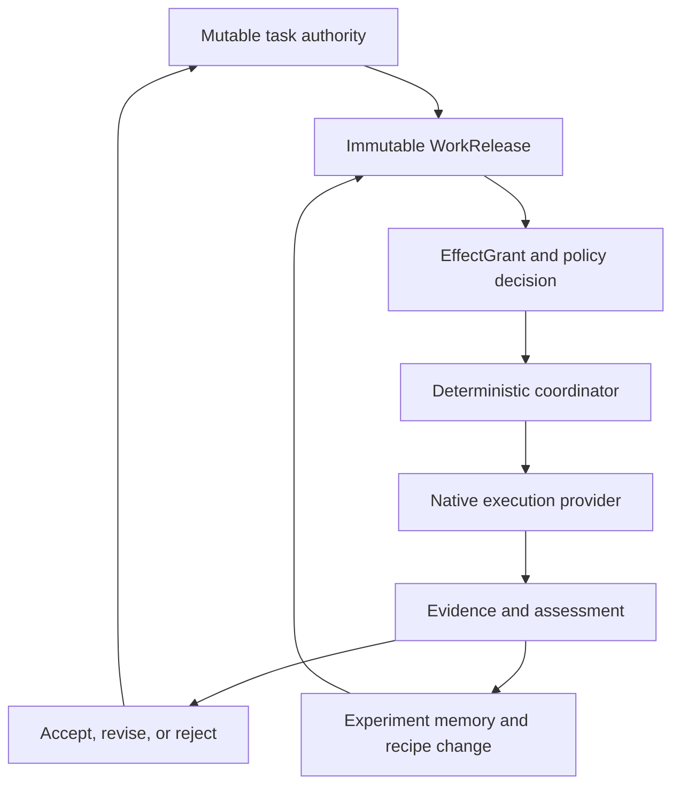

# Vuoro long-term direction

> **Superseded in part (2026-09-17).** Owner decision D1 (2026-09-14) overrides §1, §1.1, §1.2 and §14 of this document: Vuoro owns the semantics of agent-performed work (release, evidence, decision) inside sprintctl's served authority. Component and ledger-object dispositions (§5, §7.3) are recorded in `docs/direction/disposition-register.yaml` v3, which decides them on goal state. The object model and sequencing (§5, §11, §15) yield to the far-future walk's seven stored objects and S0–S8 critical path where they conflict (`/projects/dev/_artifacts/agentops/session-notes/2026-09-12-vuoro-planning/DOSSIER-far-future-architecture.md` §4, §11). For agent tooling, the target state is `/projects/dev/agentops/docs/plans/2026-09-17-target-state.md`. Where this document conflicts with any of these, they win.

**Status:** **superseded in part** (2026-09-17) — see the note above. What remains operative: the ideological rules (§3), the operating-loop reasoning (§4) as input to the walk, and the falsifiers (§13). The thesis (§1), the narrowed ownership model (§1.1) and the non-goals (§1.2) are overridden by D1. Originally established by the owner (`actor_type: human`, `authority_basis: standing-policy`, cross-repo dogfood plan §8) as the operative direction of 2026-08-28, and assessed against composition v4 (#51 @ `eea7b98`) on 2026-08-22; composition v4 has since been deleted (D4).

`current` means operative, not approved — see `agentops/model/README.md`, which supersedes every workflow that had a ratification step. This document does not wait on a sign-off, and nothing downstream should wait on one for it. It changes by being superseded, and it is tested by observations that contradict it.  
**Date:** 2026-08-22  
**Audience:** future planner, architect, reviewer, and implementer sessions  
**Scope:** intended product and architecture direction; not an implementation authorization  
**Plan of record for implementation:** `2026-08-22-extended-sprint-plan.md` (composition v4 candidate, four weeks). This document sits above it and after it — see §0.  
**Subsequent correction:** `2026-08-27-effect-intent-projection.md` rejects a
cluster-granularity single-writer reading, retains native DevOps fencing, and
limits new work to an advisory resource-graph projection for imperative effects.  
**Subsequent amendment:** `2026-09-20-vuoro-at-the-edge.md` reverses the parked verdict on
vuoro.cloud and puts an inbound public MCP surface into the target state for read, coordinate,
record and propose. §0.2 records where it lands, which non-goals it does and does not touch, and
the two conflicts it leaves open.  
**Evidence input:** `docs/evidence/2026-08-22-agentic-eventstorm.html` — a big-picture EventStorming pass over Codex, OpenCode, Claude Code and local-inference session logs on this host and the devbox (1,730 / 239 / 194 sessions sampled, $33.50 hosted spend). Its six ranked hotspots are the first evidence Vuoro has about itself; §0.1 records how they reorder §11.

## 0. Assessment and reconciliation (2026-08-22)

The draft was assessed against the v4 design freeze as revised by both review channels, the
extended sprint plan, and the agentops pre-clean-room assessment. The direction stands. Seven
amendments were applied inline, each marked `[reconciled]` where it lands:

1. **Global revision (§10).** The draft said the serialized global revision changes under
   migration. It does not: `CatalogRegistry.revision` digests registered operations, resource
   kinds and transports, not the manifest, so a lossless migration preserves it byte for byte
   and the equivalence proof asserts that equality. What changes is the profile digest,
   recorded as `migrated_from.manifest_sha256`.
2. **Cardinality (§6).** `optional` is not a fourth cardinality; it is a `required` flag
   orthogonal to `exclusive | multi | projection` (freeze §3.2).
3. **Ledger objects are capability contracts, not a Vuoro store (§5, §3.3).** Vuoro owns the
   contract *definitions*; a bound provider owns each store. This keeps the draft consistent
   with the freeze's binding correction 2 (Vuoro adds no services of its own) and with the
   2026-08-20 alignment (no Vuoro-owned runtime). Canonical storage per object is an open
   decision in §14, not an implicit Vuoro service.
4. **Federation mapping (§10, §11).** `EffectGrant` and principal binding map onto the
   freeze's three federation contracts (`federation.principal/v1`, `federation.grant/v1`,
   `federation.resource/v1`); the draft's "principal binding, grants, ACL or revision semantics"
   is that split. Their owner and scope assignments remain *proposed* pending confirmation
   (freeze §10), which is sprint week 4 item 11.
5. **Sequencing (§11, §15).** The composition v4 candidate is the prerequisite for every
   priority below: the ledger contracts need a composition to be declared in. The sprint plan's
   edits to `composition.py` are authorized; §15's "do not begin by editing `composition.py`"
   applies to the *ledger* design session, not to the candidate.
6. **Beads / Gas Town claim (§7.3).** The pre-clean-room assessment was a desk review. The
   five-lane hands-on comparison is READY (six resume observations recorded, baseline frozen)
   but no lane has run. The draft's past-tense "evaluation did not establish" is softened to
   what is actually on record.
7. **Test classification vs. the frozen R1–R8 spec (§7.1).** The agentops Gate-5 guard says
   the spec may not be amended during the comparison. §7.1's five-way classification is
   applied to R1–R8 *once, before any lane runs*, and the classified spec is then the frozen
   baseline. Classification is not a licence to re-open requirements mid-comparison.

### 0.1 Board reflection (2026-08-22, second pass)

Reflecting the EventStorming board against this document changed it in four places, marked
`[board]`:

- **Validated with receipts.** Hotspot 01 (deepseek→kimi billing failover at a reconstructed
  100–400× per-session cost, no event logged; local inference serving ~17% of OpenCode traffic
  at $0 and visible only by join) is the exact failure `WorkRelease`/`RecipeRevision` exist to
  prevent: the recipe changed mid-work with no release, grant or decision. Hotspot 06 (devbox
  and workstation never reconcile) is the authority-binding concept, observed. Hotspot 03
  (`vuoro-dispatch-ready` / `outctl-ready` name a gate that emits no transition) is our own
  naming and yields the enforcement rule in §13 falsifier 11.
- **Corrected.** An earlier critique held that Git already supplies portable checkpoints for
  coding work. Hotspot 02 refutes it: 78 handoff losses, 43 irrecoverable, are observations of
  *live infrastructure* before a fix — not committable, dead at the session boundary in all
  three tools. `EvidenceSet` is load-bearing beyond Git, and needs a **validity window** (§5.1).
- **Reprioritized.** Hotspot 04 (denial→adapt→retry is the ordinary loop; 92 permission-mode
  changes in one session) makes grant escalation a runtime lifecycle, not a launch envelope
  (§11 Priority 4). And none of the six hotspots is touched by Provider Kit, OCI artifacts or
  SBOM machinery; all six are missing *events* plus one reconciled *projection* (§9.2).
- **Reframed.** Codex's `shadow_selection_experiment` silently varies which skill activates: an
  ungoverned experiment already running *on* this stack. The experiment ledger earns its place
  as consent before it earns it as measurement (§3.6, §11 Priority 6).

The composition v4 sprint is not redirected by this: it is where the ledger contracts get
declared, and it fixes no hotspot by itself. What the board does settle is that the
external-provider proof cases (OpenBao, OTel) are dropped from the sprint rather than
"run if week 3 has room".

Not changed, and worth stating: the draft's `WorkRelease`-first priority order is kept in spirit but reordered by the board in §11; the
Restate pilot stays an unstarted, separately authorized qualification exercise; W5 and W7 stay
operator-owned / unauthorized; ActionQ PR #40 disposition matches what is already recorded.

### 0.2 Reachability reversal (2026-09-20)

The 2026-09-19 edge research (`2026-09-20-vuoro-at-the-edge.md`) found that a growing share of the
runtimes doing the work are runtimes this host does not run and cannot dial: Cowork, claude.ai,
mobile, Routines, cloud sessions, the OpenAI Responses API. Outbound pull cannot reach them. The
operator decided on 2026-09-20: **both paths, public E1 first** — a narrow public MCP surface for
interactive runtimes *and* the Managed Agents self-hosted worker for unattended runs, at the cost of
one more component, which is accepted (edge doc "Decisions left open" item 1, now marked decided).
Four amendments land inline, each marked `[edge 2026-09-20]` where it lands:

1. **Connector transport default (§9.3).** The outbound-pull default is amended, not deleted.
   Outbound pull stays the default for anything this host can reach; an inbound public MCP surface
   enters the target state for read, coordinate, record and propose. *Hosted execution remains
   outside the core promise*, and §9.3 now says explicitly that it still holds, because effects and
   credentials never cross the boundary.
2. **The surviving boundary and the non-goals (§1.1, §1.2).** §1.1 gains the structural reason the
   surface is consistent with a projection that is not a runner. §1.2 gains a per-non-goal pass:
   which are unaffected, which is amended in scope, and which is an open conflict. No non-goal is
   widened by silence.
3. **Reversal of the rebuild's park verdict (§9.3, §14).** The first-principles rebuild's verdict was
   to park vuoro.cloud. It is reversed as of 2026-09-20: vuoro.cloud proceeds, as hosted
   coordination with an inbound surface and no hosted execution. The rebuild has since landed as
   `docs/plans/2026-09-19-agentic-pipeline-first-principles-rebuild.md` (merge d47b98cb), so a reader
   can open it. The verdict being reversed is the vuoro.cloud row of its §15 Reconciliation
   table — §15 is the fifteenth `##` section, the numbering the rebuild's own prose uses — which reads "**Revisit**. superseded — see the
   companion doc Vuoro at the Edge", together with its open question "Does vuoro.cloud stay up?".
4. **Falsifier (§13 falsifier 12).** If a month of E1 passes without the substrate being reached from
   a hosted runtime, the rest is not built.

**One conflict resolved, one recorded rather than resolved.** Both are tracked in §14.

- **E3's intent queue — resolved 2026-09-20, and the blocker withdrawn.** The earlier reading of this
  entry held that E3 was unauthorized until a decision was taken, and grounded that in §1.2's "no new
  execution control plane" non-goal. Two things were wrong with it. First the grounding: this
  document's own header records that owner decision D1 (2026-09-14) overrides §1, §1.1, §1.2 and
  §14, and defers agent tooling to `agentops docs/plans/2026-09-17-target-state.md`, so an active
  blocker could not rest on §1.2. The live exclusion is TS-1's — Vuoro "is not a runner, queue,
  model router or worker supervisor". Second the substance: E3 does not cross it. An `EffectIntent`
  is a *record* of a proposed change that one homelab-side consumer polls and executes, the same
  shape as a commit Flux reconciles. Vuoro stores it and serves it on read; Vuoro never assigns,
  schedules, retries, supervises or expires an intent — any one of those five verbs voids this
  resolution. That is strictly less queue-like than `claim_work`, which TS-1 already permits, since no
  lease and no dispatch attach to an intent at all. §11's deferred "Vuoro-owned queue, retry engine,
  worker supervisor" is deferred on exactly the verbs E3 does not perform. **So the §0.2
  constraint is withdrawn: E3 is authorized, bounded.** The bound is the reason, not decoration — if
  assignment, scheduling, retry, supervision or expiry of intents is ever added, TS-1's exclusion bites and
  that behaviour belongs outside Vuoro. The reconciliation is recorded against TS-1 itself in the
  agentops target state so the live document carries it too.
- **Where a hosted runtime's evidence is authoritative.** §1.2 keeps repo shards authoritative and
  §14 settles auditctl as the canonical home of `EvidenceSet` and `Decision`. A hosted runtime holds
  no merge rights, so it cannot write a shard; `append_evidence` therefore lands in the substrate
  first. Whether the substrate's hash chain is the authoritative capture and the shard a projection
  of it, or the reverse, is undecided. As of this writing, `agentops
  docs/plans/2026-09-17-target-state.md` named no MCP surface, no public endpoint and no cloud
  runtime anywhere: TS-6 ("evidence is append-only and has one home") and TS-9 (resumability and
  successor export proven by rehearsal) had no story for a run that cannot reach that home. That was
  the gap this realignment closed: TS-16 now names all three, and the substrate-vs-projection
  question above is what TS-16's own dependency risk paragraph leaves open.

**One correction, pre-emptive.** Quota portfolio routing came out materially weaker than it was
pitched. There is no supported programmatic read of individual plan consumption on either vendor, so
predictive balancing — dispatch to whichever pool has headroom — cannot be built on published
interfaces today; only reactive failover on an observed denial is buildable, which is why it is E4
and last (edge doc §6). This document does not claim otherwise, and nothing in it needed rewriting:
§4.2 already says the token-economics fix is architectural "not merely a routing optimization", and
§8.1 lists a task-routing decision as something an experiment may vary, not a capability Vuoro has.
Recorded so that a later session does not read §16's "portfolio of agentic-work providers" as a
headroom forecast. `[edge 2026-09-20]`

## 1. Executive decision

Vuoro should become a **market-composed agentic-work distribution and control projection**.

It should not become an agent runtime, universal orchestrator, task tracker, prompt framework, model router, secret store, policy engine, or observability backend. Mature or adaptable market products and native harnesses should own those mechanisms. Vuoro should own only the semantics that must survive their replacement:

- what work was released;
- under whose authority and with which permitted effects;
- which logical agent role and effective skills were assigned;
- which provider accepted the work;
- what durable evidence came back;
- what was accepted, rejected, revised, or promoted;
- how the current operating composition differs from the previous one;
- how to recover or continue at a declared portable boundary.

The durable product promise is:

> Define work once; run it through whichever qualified provider currently fits; preserve intent, authority, evidence, recovery, and decision continuity when providers change.

Vuoro therefore productizes an **operating method for heterogeneous agentic work**, not a proprietary execution stack.

### 1.1 The surviving boundary, from the NARROW adjudication [current]

The 2026-08-20 takeover experiment adjudicated **NARROW**
(`agentops` `_projects/takeover-20260820/results/FINAL-ADJUDICATION.md`). Quoted, because
this is the decision evidence and not a restatement of it:

> NARROW the takeover architecture. Use direct Git plus a concise `HANDOFF`, exact
> receipts, explicit settlement, and acceptance for bounded single-repository
> continuation. Do not promote the experiment's broader orchestration path as the
> default.

G0 through G7 passed; G8 passed with two packaging defects — the sealed packets carried
no substantive pre-interruption inventory and no explicit continuation-eligibility rule —
which the blind reviewer nevertheless reconstructed from committed launch and handoff
records. That is a packaging defect, not transcript-only state and not a failure of the
continuation mechanism.

**The surviving boundary is a read-only reconciliation and export adapter.**
Market-composed distribution, as §1 describes it, is the **v7 horizon** and not the next
implementation phase. Vuoro survives the narrowing as the thing that projects and
reconciles state it does not own; it does not survive as a runner.

The 2026-09-20 inbound surface is consistent with that, and the consistency is structural rather
than asserted: every tool on the published surface must classify as read, coordinate, record or
propose, and there is no `vuoro:effect.apply` scope to issue — no credential a hosted runtime holds
can name a cluster resource, so its maximum achievable outcome is an unmergeable branch and a queued
intent. Vuoro is still projecting and reconciling state it does not own; what the reversal changes is
the direction of the transport, not the ownership. `[edge 2026-09-20]`

### 1.2 Non-goals [current]

Operative, from the cross-repo dogfood plan §7, and binding on every packet until
superseded by an explicit ruling:

- No new execution control plane, and no takeover runner.
- No Vuoro ownership of code, intent, evidence or acceptance.
- No centralized evidence ownership in `auditctl` — **repo shards stay authoritative**;
  auditctl owns the receipt envelope.
- No federation schema on speculation.
- No `scribedispatch` integration.
- No W7.
- No `hostproto-semantics` merge into `hostproto`.
- No pre-emptive enablement of repositories without a consumer.
- No renovation of guidance-only manifests.

Two of these are load-bearing against work already in flight and are worth stating twice.
*No pre-emptive enablement without a consumer* is why the four unsound dispatch manifests
and the six unonboarded `hostproto` successors found on 2026-08-29
(`agentops docs/assessments/dispatch-manifest-classification-2026-08-29.md`) are recorded
rather than fixed. *No renovation of guidance-only manifests* is why eleven manifests stay
as they are.

The 2026-09-20 edge work touches four of these and is silent on the rest, taken one at a time so
that none is widened by omission. `[edge 2026-09-20]` *No new execution control plane, and no
takeover runner* holds for E0 through E2, and for E3 as well: an `EffectIntent` is a record one
homelab-side consumer polls, not a queue Vuoro assigns, schedules, retries, supervises or expires
from. That is settled
against the live exclusion — TS-1's "not a runner, queue, model router or worker supervisor" —
rather than against this section, which D1 overrides; see §0.2. *No Vuoro ownership of code,
intent, evidence or acceptance* was already overridden by D1 (2026-09-14) and is not further amended by the edge work; what the edge work adds is
an internet-reachable write path into a record D1 had already placed inside Vuoro's semantics. *No
centralized evidence ownership in auditctl — repo shards stay authoritative* is **amended in scope**:
a hosted runtime cannot write a shard it has no merge rights to, which makes the authoritative
capture point for its evidence an open question, also in §0.2. *No pre-emptive enablement of
repositories without a consumer* is unaffected, and is in fact the rule the E1 stop condition applies
to the surface itself (§13 falsifier 12). The remaining non-goals — no federation schema on
speculation, no `scribedispatch` integration, no W7, no `hostproto-semantics` merge, no renovation of
guidance-only manifests — are unaffected: nothing in E0 through E4 requires any of them.

The architecture must remain valid for a future multi-operator or hosted product, but the next implementation phase must be honest about current scale: one operator, one principal environment, low run counts per task class, and no independent ecosystem consumer. Core contracts and the cockpit are current product work. Provider SDKs, signed distribution machinery, automated statistical promotion, and a general ecosystem release train remain activation-gated topology.

## 2. How the intention arrived here

Vuoro has moved through three positions:

1. **Substrate for one operator.** Sprintctl, ActionQ, Auditctl, Kctl, Agentops, and related scripts made one person's multi-agent work externally legible and recoverable.
2. **Running state accessible to workflows.** Served modes, shared authority, durable references, recovery, GitOps, and cross-host execution made the operational state usable outside one interactive shell.
3. **Distribution and control projection over a provider market.** Native frontier products, local inference, CI systems, Kubernetes, task trackers, durable-workflow engines, policy engines, secret systems, and observability products remain independently owned. Vuoro composes and governs their edges.

The third position is not a rejection of the earlier work. It separates the durable semantics discovered through that work from the mechanisms that market products may now supply better.

This is also the answer to the Beads, Gas Town, `td`, and other build-versus-buy comparisons. The question is no longer “which stack replaces Vuoro?” or “does Beads replace Sprintctl?” The questions are:

- Which semantics are actually required by the workflow?
- Which provider can supply each mechanism with lower total carrying cost?
- Which internal component remains useful because no challenger meets the required outcomes?
- Which incumbent behaviors are essential invariants, and which are merely artifacts of the incumbent implementation?

No incumbent receives a permanent right to define the admission test it already passes.

## 3. Ideological rules

### 3.1 Market-first mechanisms

Use existing products for queues, retries, durable execution, sandboxing, model access, task tracking, policy evaluation, credential leasing, telemetry, metrics, traces, evaluation datasets, and artifact storage whenever an adaptable product meets the actual requirement.

An internal component remains only until a named challenger demonstrates an equal or better operational outcome and a credible migration and exit path.

### 3.2 Normalize edges, not interiors

Vuoro standardizes provider admission, capability discovery, launch, authority, attachment, checkpoints, completion, cancellation requests, evidence publication, assessment, and decision reporting.

It does not attempt to normalize every token event, internal planning step, provider conversation object, sandbox operation, retry, or hidden session state. Provider-native features remain usable through explicit extensions.

Portability is guaranteed at declared checkpoints, not at arbitrary points inside an opaque provider session.

### 3.3 One current view, not one authority

Canonical state remains explicitly owned:

- a task system owns mutable task and readiness state;
- a durable-work provider owns its execution lifecycle, retries, leases, and internal state;
- an execution harness owns its session and sandbox;
- OpenBao-class tooling owns credential lease mechanics;
- OPA-class tooling evaluates policy but does not own the source policy data or grants;
- evidence stores own bytes;
- observability products own telemetry storage and query;
- Vuoro owns cross-provider intent, authority lineage, correlation, acceptance, compatibility, and recovery semantics — as contract definitions bound to providers, not as a Vuoro-hosted store. `[reconciled]`

Vuoro may project these authorities into one operator view. It must not silently create a second writable copy.

### 3.4 Centralize only what requires agreement

Shared identity, grants, policy linkage, work-release identity, evidence indexes, decisions, compatibility, and recovery coordination may require shared authority.

Repositories, worktrees, native harnesses, model credentials, interactive attachment, local execution, and credential injection stay where the work runs. Local and break-glass operation remain first-class. Served mode is explicit; there is no silent local/served hybrid writer.

### 3.5 Provider replacement must preserve the reason for the system

For every proposed Vuoro feature, ask:

> If replacing the provider makes this feature irrelevant, buy or adapt it. If the information must survive provider replacement to preserve intent, authority, evidence, recovery, or learning, Vuoro owns the contract.

### 3.6 Experimentation is change memory before it is statistics

At current volume, provider and model promotion cannot pretend to be statistically decisive. The immediate value of an experiment record is durable memory:

- what changed;
- why it changed;
- what evidence was considered;
- where judgment remained subjective;
- why the new recipe was selected;
- how to revert.

Automated promotion thresholds become justified only when repeated comparable work produces enough evidence.

Before either, the record is **consent**: a vendor- or harness-side experiment that varies the effective recipe without a `Decision` is exactly what hotspot 01 and Codex's `shadow_selection_experiment` show happening today. Adaptation is a governed workflow because ungoverned adaptation is already running. `[board]`

## 4. The intended operating loop

### 4.1 Mutable task, immutable release

The task remains mutable in its owning system. A `WorkRelease` freezes exactly what was authorized and handed to an execution provider at a point in time.

It should include or reference:

- task authority and immutable task revision;
- intended outcome and completion contract;
- bounded context and source references;
- relevant dependencies and known uncertainty;
- effective agent profile and recipe revision;
- required evidence and validation;
- permitted effects and escalation conditions;
- expected portable checkpoint form;
- stale-completion and supersession behavior.

Changing a mutable task does not rewrite an issued release. A material change produces a new release or explicit supersession.

### 4.2 Deterministic coordination, episodic supervision

The token-economics fix is architectural, not merely a routing optimization.

Cheap deterministic machinery should handle:

- provider dispatch and acknowledgement;
- progress and heartbeat collection;
- waiting, timeouts, and retry mechanics owned by the selected coordinator;
- missing-evidence detection;
- state projection and reconciliation;
- aggregation of completed or blocked work;
- explicit escalation triggers.

A frontier supervisor should be invoked only for transitions that benefit from frontier judgment:

- ambiguous or conflicting state;
- plan changes spanning several work releases;
- provider failure without a deterministic recovery path;
- substantive review or synthesis;
- policy exceptions;
- a batch of completed work requiring alignment;
- uncertainty that cannot be resolved by collecting more declared evidence.

The supervisor receives a bounded takeover packet rather than repeatedly polling raw sessions. Interactive narrative tracks remain attachable at any time, but they are clients of the operational state, not hidden schedulers.

The immediate measurement is not “number of agents.” It is:

- frontier turns per accepted work release;
- frontier time spent polling or restating known state;
- human interventions per release;
- stale or conflicting completions;
- evidence retrievals required after initial handoff;
- first-pass acceptance and reviewer finding rate.

### 4.3 Provider-native execution

Codex, Claude Code, OpenCode, local inference, CI, Kubernetes jobs, and future market runtimes retain their own execution models. A provider adapter needs only to support the edge contract appropriate to that provider:

- capability declaration;
- launch or handoff creation;
- opaque execution/session reference;
- status or explicit completion receipt;
- interactive attachment instructions where supported;
- durable evidence publication;
- cancellation semantics where supported;
- declared recovery and checkpoint boundary.

Subscription-native frontier products need not be forced through API economics. Their adapter may prepare the work packet, create or bind a native session, record its reference, and wait for an explicit completion or checkpoint receipt.

## 5. Minimal durable model

The earlier nine-object formulation was too eager. The v4 core should distinguish ledger objects from versioned specifications and ordinary relations.

Each object below is declared as a v4 **capability contract** (`<name>/v1` with cardinality,
scope kind, `required`, `frozen`, owner) and stored by whichever provider is bound to it. Vuoro
owns the contract definition and its falsifiers; it never owns the store, and no object here
authorizes a Vuoro service. `[reconciled]`

### 5.1 Core ledger objects

#### `WorkRelease`

The immutable unit of released intent and acceptance criteria.

#### `EffectGrant`

A payload- or scope-bound authorization for consequential effects. It records principal, effect class, target scope, constraints, expiry, policy decision reference, and use or uncertain-use state.

It must never imply automatic replay after an uncertain outcome.

A grant has a **runtime lifecycle**, not only a launch envelope: requested → granted | denied → adapted → re-requested, each an event (`GrantEscalated`). Denial history feeds policy *inputs* — as a `Decision`, never as automated policy mutation, and never written into OPA, which evaluates but does not own source policy (§3.3). Without this the cockpit's authorization pane is a 92-clicks-per-session approval mill spending the scarce resource exactly where it should not. `[board]`

#### `EvidenceSet`

A correlated set of durable references and integrity metadata. It may contain Git commits, diffs, tests, artifacts, command captures, logs, reviewer reports, evaluator scores, or non-Git checkpoint material.

Every item carries a **validity window** declared by its collector (Auditctl-class tooling, or the harness): the period over which an observation of a live system may be trusted in place of re-acquiring it. Git-backed items are valid indefinitely at their hash; live-infrastructure observations (`flux reconcile`, `sprintctl doctor`, node state) expire. The reader-side rule is a projection: trust within the window, re-acquire outside it, and emit `EvidenceExpired` rather than silently rerunning. This is the fix for hotspots 02 and 05 together, and it does not grow Auditctl beyond bounded evidence acquisition. `[board]`

#### `Decision`

An explicit acceptance, rejection, revision, supersession, policy exception, provider selection, or rollback decision referencing the evidence considered.

#### `ExperimentRecord`

A versioned memory of a recipe or provider comparison: hypothesis, baseline, challenger, task sample, evidence, limitations, rationale, and resulting decision. Automated promotion is not required.

### 5.2 Versioned specifications

#### `RecipeRevision`

A task-class or workflow-specific execution recipe. It binds provider selection policy, logical agent profile, model or model-selection policy, context compiler, tools, workflow template, validation, and escalation behavior.

This replaces the earlier overlap between `ExecutionRecipe` and `CompositionRelease`. A general ecosystem composition release is a later packaging concern.

#### `AgentProfileRevision`

The missing meta-layer above native harnesses. It defines a logical agent role independently of whichever runtime currently executes it.

It should include:

- stable logical agent or role identifier;
- purpose and supported task classes;
- inherited skills and explicit overrides;
- hook bindings and ordering;
- context and handoff compiler;
- required tools or capabilities;
- preferred and forbidden providers;
- effect ceiling and approval requirements;
- evidence obligations;
- interaction mode: unattended, episodically supervised, or interactive;
- completion and escalation contract.

Inheritance must be compiled into a flat, content-addressed effective profile when a `WorkRelease` is issued. Runtime changes must not alter the already released role definition.

The logical agent identifier is not itself an authorization principal. Each runtime actor receives an explicit identity binding and `EffectGrant`. Reissuing a provider actor string must never transfer historical ownership or authority.

### 5.3 Relations rather than objects

- An execution reference is an opaque foreign reference attached to a release attempt, not a first-class Vuoro state machine.
- An assessment is evidence with evaluator identity and method metadata; the subsequent judgment is a `Decision`.
- A checkpoint is an `EvidenceSet` item or relation. For coding work, the normal portable checkpoint is a Git commit plus evidence. Vuoro must not wrap Git merely to manufacture another noun.
- An authority binding maps a capability and scope to its active canonical provider. It is governance configuration and history, not a new execution object.

## 6. Planes and capability ownership

Planes are an operator taxonomy, not a demand for six new network services. Validation binds providers to small versioned capabilities, not to vague plane membership.

| Plane | Representative mechanisms | Vuoro-owned cross-provider semantics |
| --- | --- | --- |
| Work and tracking | Sprintctl, GitHub, Jira, Beads-class tools | Work-release binding, readiness projection, supersession |
| Coordination | ActionQ today; Restate, Hatchet, DBOS, Temporal-class challengers | Dispatch intent, declared checkpoints, opaque references, reconciliation |
| Execution | Codex, Claude Code, OpenCode, `local3090`, CI, Kubernetes | Agent profile, handoff, grants, attachment and evidence edge |
| Authority and policy | OIDC, OPA, OpenBao | Stable principal binding, effect grants, policy inputs and decision lineage |
| Evidence and provenance | Git, object storage, Auditctl | Correlation, completeness, integrity, acceptance and recovery references |
| Observability and analytics | OpenTelemetry, Prometheus, evaluation products | Correlation identifiers, required signals, scorecard and experiment decision |

Capabilities declare cardinality:

- **exclusive:** at most one active canonical provider per scope;
- **multi:** several providers may operate simultaneously, such as telemetry exporters;
- **projection:** derived or read-only, never authoritative.

Whether absence is legal is a separate `required` flag on the capability, orthogonal to
cardinality: a capability can be optional *and* exclusive when present. `[reconciled]`

A provider may implement several capabilities, but authoritative capabilities that require independent release and migration must not be coupled into one unchangeable release unit merely for packaging convenience.

## 7. Build-versus-buy and challenger qualification

### 7.1 The incumbent suite is not neutral

ActionQ and Sprintctl discovered real failure modes, but a conformance suite derived directly from their APIs will naturally encode their implementation choices. A challenger should not have to impersonate the incumbent to replace it.

Qualification therefore has two explicit layers:

1. **Outcome and invariant suite.** Provider-neutral black-box scenarios derived from operator failures and required outcomes.
2. **Migration compatibility suite.** Incumbent-specific behavior required only to migrate existing state or preserve a frozen compatibility boundary.

Every test must be classified as one of:

- essential safety or recovery invariant;
- essential workflow outcome;
- migration-only compatibility;
- incumbent convenience;
- unresolved assumption.

Only the first two are permanent admission criteria. Migration-only requirements expire when the old state is retired.

This classification is applied to the frozen R1–R8 reduced-workflow spec once, before any
clean-room lane runs; the classified spec is then the baseline the Gate-5 guard protects. It is
not a mechanism for amending requirements while a candidate is being tested. `[reconciled]`

### 7.2 Required comparison controls

The incumbent must compete against:

- the smallest direct-control workflow (`td`-style minimization control);
- a reduced Vuoro using native provider features;
- an external coordination/task stack;
- a durable-workflow provider;
- the current internal stack.

No outcome is privileged. A challenger may win by satisfying fewer semantics if the excluded semantics are shown not to earn their carrying cost.

A replacement should either:

- remove a named hard failure class;
- unlock a required capability the incumbent cannot provide; or
- reduce ongoing operational and maintenance burden materially, with approximately 30% as the working carrying-cost threshold.

### 7.3 Current component disposition

#### ActionQ

ActionQ remains the current durable run authority until a challenger qualifies. Its durable long-term contribution may become the invariant suite, migration evidence, and adapter rather than the execution implementation itself.

#### Sprintctl

Sprintctl remains the reference local work authority. External task systems may replace it only with explicit authority fencing and reconciliation. Transparent dual-writer synchronization remains disallowed.

#### Auditctl (and Outctl, retired)

Auditctl's distinctive value is thin, bounded, policy-aware evidence acquisition and provenance. It should not grow into a general log or analytics platform. Outctl was retired from the Vuoro project binding on 2026-08-20 (agentops `67f1f6d`) and stays retired unless evidence indicates a revival; its role here is historical. `[reconciled]`

#### Beads and Gas Town

They remain useful challengers and sources of design evidence, not proven replacements. The pre-clean-room desk assessment did not establish safe authoritative work/execution replacement or the required cross-harness meta-layer of logical identities, skills, and hooks; the hands-on five-lane comparison (`agentops/docs/plans/Vuoro-Clean-Room-Comparison-Plan.md`, Lane 1 mandatory) is ready but has not run, so this is an open prior, not a result. `[reconciled]`

#### Restate and other durable providers

The Restate pilot remains an unstarted qualification exercise, not an architectural commitment. The same applies to other durable-workflow products until measured against the provider-neutral scenarios.

## 8. Experimentation and adaptation

### 8.1 What may vary

An experiment may change:

- model;
- native harness or provider;
- local versus hosted execution;
- logical agent profile;
- skill or hook bundle;
- context compiler;
- workflow template;
- validation or reviewer pattern;
- policy or effect ceiling;
- task-routing decision.

The full effective recipe must be recorded. “Same model” is not reproducibility when the harness, tools, skill set, context, or policy changed.

### 8.2 Current-scale lifecycle

Use a deliberately light lifecycle:

1. Record the challenger and hypothesis.
2. Run it on bounded real work or a small reusable fixture set.
3. Attach deterministic checks and human review.
4. Record limits, failures, intervention, time, and cost where available.
5. Make an explicit keep, prefer-for-task-class, reject, or revisit decision.
6. Preserve the prior recipe and rollback path.

Terms such as shadow, canary, and preferred may be used descriptively, but they do not justify automated promotion at current volume.

Models are ephemeral. New runnable local or hosted models should be evaluated routinely rather than only after the incumbent fails. “Best” remains task-class- and constraint-specific.

### 8.3 Future activation

Statistical promotion, evaluation platforms, online scoring, and automated canary progression become load-bearing only after enough comparable runs exist to make their outputs more informative than operator judgment.

Until then, the experiment ledger is primarily an antidote to forgetting why a change was made.

## 9. Product surfaces

### 9.1 Current product surface

The current product is:

- core contracts and ledger;
- a runnable local mode;
- one current operational projection;
- fresh-context takeover packets;
- interactive narrative supervision;
- evidence and decision correlation;
- provider-specific adapters developed as thin local code;
- `CONTRACTS.md` conventions and executable fixtures;
- explicit migration, bypass, shadow, enforce, and rollback states where authority changes.

### 9.2 Long-term product surface

The long-term topology may include:

- a formal Provider Kit;
- tested composition profiles;
- signed OCI composition artifacts;
- SBOMs, attestations, and conformance reports;
- team and cloud distributions;
- public provider admission and compatibility matrices.

This is not the next-six-month roadmap. The 2026-08-22 board makes the point sharply: zero of its six ranked hotspots is addressed by any item above, and all six are addressed by events and one projection. `[board]` It activates when at least one of the following becomes true:

- a second independently operated deployment consumes the contracts;
- an adapter is maintained outside the primary repository or by another person;
- two deployment profiles require independent compatibility support;
- external distribution creates a real supply-chain or upgrade-support obligation;
- manual compatibility reasoning becomes a measured recurring burden.

Before such a trigger, a repository manifest, `CONTRACTS.md`, exact dependency pins, conformance commands, and an upgrade report are sufficient. OCI and CycloneDX are available future packaging mechanisms, not proof of current product maturity.

### 9.3 Hosted direction

If Vuoro Cloud proceeds, it hosts shared coordination and authority rather than execution:

- accounts, workspaces, identities, grants, policy linkage, and one current view;
- optional served domain authorities and tenant databases;
- evidence indexes and receipts;
- compatibility and migration control.

Users retain repositories, worktrees, workers, native harnesses, credentials, execution hosts, and optionally artifact storage.

Connector transport defaulted to outbound pull. That default is **amended, not deleted** (operator, 2026-09-20). Outbound pull remains the default for anything this host can reach; an **inbound public MCP surface is now in the target state** for read, coordinate, record and propose, alongside the Managed Agents self-hosted worker for unattended runs, which exposes no endpoint at all. Both paths, public E1 first. The reason is reachability rather than preference: a Cowork, claude.ai, mobile, Routines, cloud or OpenAI Responses session is not a host this substrate can dial, and outbound pull has no way to reach the runtimes now doing a growing share of the work. `[edge 2026-09-20]`

**Hosted execution remains outside the core promise, and that still holds.** The inbound surface does not weaken it, because effects and credentials never cross the boundary. Intent, coordination and evidence cross; applied changes do not. No credential issued to a hosted runtime can name a cluster resource, there is no `effect.apply` scope, and leaving it undefined is a recorded design decision rather than an omission. A hosted runtime proposes an `EffectIntent`; a homelab-side reconciler that already holds the credentials executes it and signs it, so branch protection and signature verification apply unchanged. Be exact about what that signature is worth. It is the reconciler's own, and it attests that the reconciler applied the change — nothing more. It does not attest the hosted run that proposed it: the property obtained is a verifiable chain from a signed commit back to a run record naming runtime, model and profile revision, which is **recorded and reconstructable, not attested**, and must not be described as attestation anywhere downstream. Nothing here vouches for what the hosted runtime actually did; it vouches for what was proposed, what was applied, and by whom. See `2026-09-20-vuoro-at-the-edge.md` §3 (the boundary) and §8 (threat model change). §8 is also where the price of the reversal is stated plainly: a public, credential-holding endpoint with one user and no on-call, whose Phase 0 controls — evidence chaining, lease expiry, audience validation, rate limiting, endpoint monitoring — stop being hygiene and become load-bearing. `[edge 2026-09-20]`

This reverses the first-principles rebuild's §15 verdict to park vuoro.cloud — the vuoro.cloud row of its §15 Reconciliation table, "**Revisit**. superseded — see the companion doc Vuoro at the Edge", and its open question "Does vuoro.cloud stay up?". The rebuild landed as `docs/plans/2026-09-19-agentic-pipeline-first-principles-rebuild.md` (merge d47b98cb); its `##` sections are numbered 1-18 as of 2026-09-20, the numbering its own prose already used, so § numbers resolve literally. §0.2 records the reversal, the conflict it resolves and the one it leaves open. `[edge 2026-09-20]`

## 10. Composition v4 direction

Composition v3 incorrectly allowed packaging topology to determine domain topology. The v4 design should describe:

- capability contracts;
- authority cardinality and scope;
- providers and thin adapters;
- exact artifact, configuration, policy, and schema identity;
- local, shared, served, and optional capability modes;
- conformance and compatibility evidence;
- migration and rollback relations;
- recipe and agent-profile references;
- semantic equivalence from the frozen v3 composition.

It should not begin by implementing a general provider ecosystem.

The v3-to-v4 migration must preserve selected providers, operation hashes, frozen execution semantics, observable authority boundaries, the declared dependency closure, and the served global catalog revision **byte for byte** — that revision digests registered operations, not the manifest, and a change to it is a fleet-wide `409 stale-catalog` cutover. What changes is the profile's own identity (its manifest digest); the v4 profile records `migrated_from.manifest_sha256` and the equivalence proof. `[reconciled]`

The five-descriptor W4 freeze is superseded. Federation becomes three authority-plane capability contracts — `federation.principal/v1` (frozen), `federation.grant/v1` (iterates), `federation.resource/v1` (the W3 ledger) — whose owner and scope assignments are proposed in the freeze and confirmed before packaging. A second ActionQ distribution is not authorized merely to satisfy the old descriptor count. `[reconciled]`

## 11. Next six months: buildable priority order

### Priority 0 — composition v4 candidate (in flight)

The extended sprint plan: merge #51, port the falsifier gate and orchestrator, uniform
construction protocol, validator rules 1–9, byte-identical migration proof, wheel-first proof
case, W4 rescope. Every priority below declares its objects as capability contracts inside this
composition, so it is a prerequisite, not a parallel track. `[reconciled]`

### Priority 1 — first-class events for the shadow domains `[board]`

Emit `ProviderSwitched`, cost attribution (including $0 local-inference sessions),
`GrantEscalated` / denied / adapted, and lifecycle transitions for anything named `-ready`, into
auditctl. Cheapest move on the board: it closes hotspot 01, half of 04, all of 03, and makes local
inference exist in the ledger.

### Priority 2 — `EvidenceSet` with validity windows `[board]`

Collector-declared validity on live-infrastructure observations, reader-side trust-or-reacquire
projection, `EvidenceExpired` event. Closes hotspots 02 and 05. This is the object the draft was
missing.

### Priority 3 — `WorkRelease` and authority binding

Implement the mutable-task/immutable-release split and explicit binding to the owning task authority, with `RecipeRevision` bound at issue so a mid-work provider change is definitionally a new release requiring a `Decision`. Include supersession, stale completion, and fresh-context takeover.

### Priority 4 — `EffectGrant` runtime lifecycle

Implement payload- or scope-bound effect grants, principal binding, policy-decision reference, expiry, uncertain-use handling, and the escalation lifecycle from §5.1 with denial-history → policy-input feedback as `Decision`s. This is `federation.grant/v1` over `federation.principal/v1`; the Identity → `FederationPrincipal` stable-identifier rule (sprint week 4) is its prerequisite. OPA and OpenBao are evaluators/providers at their existing boundaries (`policy.decision/v1`, `secret.lease/v1`); Vuoro owns grant and decision lineage as contract. `[reconciled]`

### Priority 5 — cross-host authority reconciliation `[board]`

One projection over devbox and workstation (hotspot 06), per the existing cursor/watermark
pattern. Two writable hosts that never reconcile is the mirror image of the two-writable-task-
authorities rule Sprintctl already forbids.

### Priority 6 — `Decision` correlation, `AgentProfileRevision`, experiment memory

Correlate Auditctl/Git/object-store evidence with explicit acceptance, rejection, revision and supersession decisions (evidence durable before acknowledgement where loss would make settlement unverifiable). Add the cross-harness logical identity, skill, hook, context, policy and handoff layer, flattened into each release. Record recipe revisions, challenger evidence, intervention, reviewer findings, switch rationale and rollback — reframed as memory *and consent*, surfacing vendor-side experiments such as `shadow_selection`. Do not automate promotion.

### Priority 7 — episodic-supervisor coordination and the external-provider pilot

Change the coordinator so that frontier supervisors are called on semantic gates, not polling loops; measure subscription/frontier utilization before and after. Then run one provider-neutral workload through the incumbent, minimization control, and one market durable-workflow challenger. The previously proposed ActionQ review loop on the appservice cluster remains a reasonable pilot workload if separately authorized.

### Explicitly deferred

- formal Provider Kit SDK;
- public adapter marketplace;
- OCI reference distribution;
- CycloneDX or attestation pipeline beyond an actual distribution need;
- automated champion/challenger promotion;
- generic central audit ingestion without a consumer;
- transparent live migration of opaque sessions;
- a Vuoro-owned queue, retry engine, worker supervisor, model router, or prompt platform;
- multi-tenant hosted execution.

## 12. W4 and PR #40 disposition

PR #40 remains valuable as a reviewed record of the failed W4 assumptions, validator weaknesses, and measured review-instrument performance. Its green test state does not make the old five-descriptor implementation buildable.

Recommended disposition:

1. Preserve the scope-review corrections, coverage measurements, and claim/scope falsifier repairs.
2. Mark the old W4 implementation direction as superseded by the v4 authority and capability design.
3. Do not publish an immutable federation wheel under the old topology.
4. Reuse the existing freeze invariants as inputs to the provider-neutral outcome suite, classifying incumbent-specific behavior explicitly.
5. Resume implementation only after `WorkRelease`, principal/authority ownership, and minimal v4 capability semantics are frozen through the existing review channels.

The current review baseline—nine measured findings, 47% baseline coverage, and “usable as a baseline: no”—should remain an honest measurement result rather than be rounded upward by process enthusiasm.

## 13. Falsifiers for the direction

The direction is wrong or overbuilt if any of the following cannot be demonstrated:

1. A work release can be understood and settled from fresh context without the originating interactive session.
2. Deterministic coordination materially reduces frontier polling and synthesis overhead.
3. Direct local tools remain usable when Vuoro is absent or degraded.
4. A provider can be replaced at a declared checkpoint without rewriting historical intent, grants, evidence, or decisions.
5. Reissuing a provider actor string cannot acquire historical ownership or authority.
6. A challenger can fail incumbent compatibility tests yet still qualify by satisfying the essential outcome suite and an explicit migration plan.
7. Git-native work uses Git-native checkpoints rather than duplicated wrapper state.
8. An experiment record helps explain or reverse a provider/recipe change even when the sample is too small for statistical promotion.
9. The cockpit provides material operational value beyond concatenating native provider UIs.
10. Deferred ecosystem packaging remains absent until an activation trigger is observed.
11. Every ledger contract names the lifecycle events its transitions emit, and those events are observed in auditctl. A Vuoro object that emits no lifecycle events is not an object, it is a name — `vuoro-dispatch-ready` is the counterexample already on record. `[board]`
12. The read surface proves the need. If a month of E1 — `list_ready_work` and `describe_work`, one
    static bearer token — passes without the substrate once being reached from a hosted runtime, the
    rest of the edge work is not built: no claims over MCP, no evidence, no `EffectIntent`, no
    reactive failover. This is the falsifier the operator attached to the 2026-09-20 decision, and
    it is §1.2's "no pre-emptive enablement without a consumer" applied to the surface itself.
    `[edge 2026-09-20]`

If ordinary solo work remains neutral or negative and multi-agent bursts do not compensate for the carrying cost, minimization or removal remains a valid outcome.

## 14. Settled, open, and deferred decisions

### Settled direction

- Vuoro composes independently owned providers and presents one current view.
- Execution remains provider-native and generally user-owned.
- Market mechanisms are preferred where they meet the required outcome.
- `WorkRelease`, effect authority, evidence, and decisions are durable core semantics.
- **Auditctl is the canonical home of `EvidenceSet` and `Decision`.** `[settled 2026-08-30 by the owner]`
  It already holds the rule these objects need — it records what was observed and never what
  should be — and it is the only store in the workspace that enforces it. This settles them as
  *ledger objects auditctl records*, which is not a licence to grow it into the general log or
  analytics platform §11 rules out: acquisition and provenance stay thin and bounded.
  The consequence is the reason it was asked. Every artifact that today improvises whether it
  is a record or a build output — `verification/results/`, acceptance-lab `campaigns/` — is a
  **derived build output that cites a ledger id**, and the gate guarding each stops having to
  invent which it is. Falsifier: an evidence artifact that no ledger id resolves to, or a
  decision reachable only by reading a file in a working tree.
- Frontier supervisors are episodic; deterministic systems handle polling and waiting.
- Logical agent profiles, skills, and hooks must exist above individual harnesses.
- Provider portability is checkpoint-based, not transparent live-session migration.
- Local mode and direct recovery remain first-class.
- **E3's `EffectIntent` plus homelab reconciler is a record, not a queue, and is authorized.**
  `[settled 2026-09-20]` It was carried as an open decision against §1.2's "no new execution control
  plane"; §1.2 is overridden by D1, and against the live exclusion — TS-1's "not a runner, queue,
  model router or worker supervisor" — E3 does not cross it, because Vuoro stores and serves intents
  and never assigns, schedules, retries, supervises or expires it. Bounded: adding any of those five
  verbs puts the behaviour outside Vuoro. §0.2 carries the reasoning. Falsifier: an intent Vuoro
  hands to a named consumer, re-queues after a failure, or expires on its own.
- **E4 records and parks; it does not route.** `[settled 2026-09-20]` On a rate-limit denial the
  substrate records the `rate_limit_event`, releases the lease, parks the claim and records which
  model family the next attempt used. Choosing that family is the harness's or the dispatcher's act
  — TS-1 excludes model routing and TS-2 keeps model choice native to the harness.
- Experimentation is versioned memory before automated optimization.

### Open architecture decisions

- exact principal and external-identity binding model;
- the first market durable-workflow challenger and pilot envelope;
- which ActionQ and Sprintctl semantics survive the provider-neutral classification;
- the minimal v4 manifest and migration proof;
- where each ledger object and versioned specification is canonically stored — which bound provider owns `WorkRelease` (Sprintctl as work authority is the default candidate) and `EffectGrant` (ActionQ federation), and where logical agent profiles and skill artifacts live; `EvidenceSet` and `Decision` are settled below. `[reconciled]` `[narrowed 2026-08-30]`
- the smallest cockpit that measurably improves takeover and supervision;
- whether served/cloud demand becomes real enough to justify productization — **under test rather
  than open in principle** since 2026-09-20: E1 is the cheap experiment and §13 falsifier 12 is its
  stop condition; `[edge 2026-09-20]`
- where a hosted runtime's evidence is authoritative, given that it holds no merge rights and so
  cannot write the repo shard §1.2 keeps authoritative. `[edge 2026-09-20]`

### Deferred topology

- public Provider Kit;
- Reference Distribution release engineering;
- automated qualification and promotion;
- general multi-tenant ecosystem and marketplace;
- hosted execution.

## 15. Implementation handoff contract

The next *ledger* planning session should not begin by editing `composition.py` or creating another wheel — the composition v4 candidate sprint owns those edits and runs first. `[reconciled]` That session should produce a reviewed design freeze containing:

1. minimal schemas for `WorkRelease`, `EffectGrant`, `EvidenceSet`, `Decision`, `RecipeRevision`, and `AgentProfileRevision`;
2. authority and identity binding, including reissuable external identities;
3. stale, superseded, late-completion, and uncertain-effect transitions;
4. Git-native and non-Git evidence/checkpoint examples;
5. episodic-supervisor triggers and bounded takeover packet;
6. provider-neutral invariant scenarios separated from incumbent migration compatibility;
7. the minimal v3-to-v4 semantic migration;
8. explicit non-goals and activation triggers for deferred packaging.

Each normative claim should have a falsifier bound to the claim and scope. Reusing the same scope text across claims must remain mechanically rejected, but the review must also examine claim-to-scope and scope-to-test meaning; checking one edge of that triangle is not sufficient.

## 16. End-state statement

> Vuoro is the governed distribution and control projection for a continuously changing portfolio of agentic-work providers. It packages a reproducible operating method, not a proprietary execution stack.

At current scale, that means a small durable kernel, strong takeover and evidence semantics, a useful cockpit, and deliberately thin adapters. If a real provider ecosystem or second independent consumer emerges, the same contracts can grow into formal provider kits, signed composition releases, and hosted coordination without changing what Vuoro fundamentally owns.

## References informing the market boundary

- [Restate durable agents](https://docs.restate.dev/ai/patterns/durable-agents)
- [Hatchet architecture and guarantees](https://docs.hatchet.run/v1/architecture-and-guarantees)
- [DBOS architecture](https://docs.dbos.dev/architecture)
- [Open Policy Agent external-data model](https://openpolicyagent.org/docs/external-data)
- [OpenBao lease model](https://openbao.org/docs/concepts/lease/)
- [OpenTelemetry semantic conventions](https://opentelemetry.io/docs/specs/semconv/)
- [Langfuse experiments](https://langfuse.com/docs/evaluation/experiments/experiments-via-sdk)
- [ORAS OCI artifacts](https://oras.land/docs/concepts/artifact)
- [CycloneDX composition model](https://cyclonedx.org/specification/overview/)
