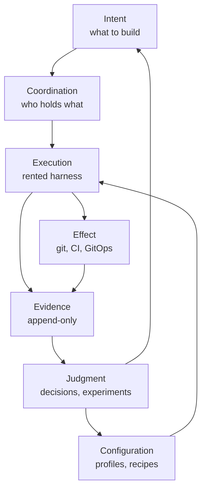

# Agentic Pipeline: A First-Principles Rebuild

**Status:** Architecture design note. Reference for the E0-E4 (reachability, TS-16) work and for the vuoro reconciliation in §15.
**Written:** 2026-09-19
**Landed:** 2026-09-20, exported from the artifact by the session that picked up the extended realignment. Origin: https://claude.ai/artifact/7iBnzJVHGpSskjyHz7QEvE (updated 2026-09-19). This repository copy is now the citable one.

2026-09-19 · @Someone

## Scope and method

This derives an agentic pipeline from requirements without reference to your current components, then reconciles the result against what you run. Scope is substrate, runtime and platform: work coordination, the execution edge, secrets, policy, context, evidence, cluster placement and the meta-layer.

Method, in order:

1. State the irreducible facts about agentic work that any design must survive (§2).
2. Derive requirements from those facts, and constraints from your operating position (§2–3).
3. Specify a target architecture plane by plane, with a market scan per plane (§4–13).
4. Settle build-vs-buy (§14), reconcile against the current stack (§15), and sequence the move (§16).

Out of scope by choice: fully autonomous delegation, realtime tool-framework flows, and agent-substrate management in the Foundry sense. Also out: anything justified by external users, since there are none.

One reading rule. The derived target in §4–13 is not a plan. It is the thing §15 measures your stack against, and only §16 is a sequence you would act on.

## First principles

Five facts about agentic work are not design choices, and everything else follows from them.

**F1 — The worker is unreliable at task level and cannot self-certify.** Non-determinism is the point of the tool; it also means a worker's "done" is an opinion. Measured: models drop ~39% single-turn to multi-turn, and the loss is mostly unreliability rather than capability ([Laban et al., ICLR 2026](https://arxiv.org/abs/2505.06120)).

**F2 — Attention is bounded and degrades non-uniformly with length.** Degradation is worst where the needle is semantically distant from the question, and distractors compound ([Chroma, Context Rot](https://www.trychroma.com/research/context-rot)). Even 1M-token models degrade; a memory architecture beats a bigger window ([BEAM, ICLR 2026](https://arxiv.org/pdf/2510.27246v2)).

**F3 — Operator attention does not scale with worker throughput.** One person reviewing diffs is a hard ceiling somewhere near one agent. Everything past that ceiling is either unreviewed or reviewed by machine.

**F4 — Execution is rented and churns.** OpenAI deprecated its agent framework layer twice in eighteen months; MCP's 2026-07-28 revision removed the handshake, sampling, roots, logging and elicitation. Anything you build on a provider's interior has a short half-life.

**F5 — Effects are irreversible in a way that tokens are not.** A wasted run costs money; a merged wrong change, a deleted volume or a leaked credential costs something else. Blast radius is therefore a property of the grant, never of the prompt.

### Requirements

| # | Requirement | From |
| --- | --- | --- |
| R1 | Work has durable external identity and state that survives session death | F1, F2 |
| R2 | A unit is sized to one session's competent attention; decomposition is a first-class operation | F2 |
| R3 | Assignments are exclusive **and leased** — a claim that cannot expire is a deadlock | F1 |
| R4 | Completion is asserted by a verifier that is not the producer | F1 |
| R5 | Every state transition is append-only and attributable to a named identity | F3, F5 |
| R6 | Effects are capability-granted before a session starts, never prompt-requested during it | F5 |
| R7 | The operator reviews classes and exceptions, not instances | F3 |
| R8 | Evidence reconstructs *why*, not only *what* — including which model, profile and recipe produced it | F1, F4 |
| R9 | Harness, model and provider are parameters of a run, not properties of the system | F4 |
| R10 | Cost and quota are first-class signals that feed back into scheduling | F4 |
| R11 | Configuration — profiles, skills, hooks, recipes — is versioned data, and a run names the versions it used | F4, R8 |
| R12 | Any change to the setup can be tested against a fixed task set before adoption | F1, R11 |
| R13 | The whole thing degrades to one operator in one terminal, with no substrate running | F5 |

R13 is the recovery-first rule you already apply to the cluster, applied to the pipeline. R3, R8 and R12 are the three that most implementations — including most of the market — quietly skip.

## Constraints, and the shape they force

Four constraints bind harder than any technical choice, and three of them push the design the same direction.

**Quota, not architecture, is the parallelism ceiling.** Subscription usage runs on overlapping 5-hour rolling and weekly windows, shared across Claude Code, claude.ai and Cowork, and there is no support-side reset ([costs](https://code.claude.com/docs/en/costs)). Your stated target — 5+ meta-coordinators driving 10+ sessions — is a spend decision, not a design problem. Gas Town practitioners running that shape report needing multiple $200/month accounts and $100/hour token burn ([Wangdhen](https://tenzinwangdhen.com/posts/gastown-good-bad-ugly/), [paddo.dev](https://paddo.dev/blog/gastown-two-kinds-of-multi-agent/)).

**One operator, no external validator.** Nothing in the design may assume a second reviewer, an on-call rotation, or a user whose complaint would surface a defect. Every quality property must be produced by machinery or it does not exist.

**The corpus is hobby and self-study.** That removes the usual justification for generality but not for rigour — and it makes maintenance burden the dominant cost. A component you must chase through other people's breaking changes is expensive even when free.

**A homelab that predates all of this.** Talos, Flux, Longhorn, OPNsense and a recovery-first GitOps philosophy already exist and already work. The pipeline should be a tenant of that platform, not a second platform beside it.

### What this forces

- **Own contracts, rent execution.** F4 plus maintenance cost says the durable objects are yours and the runtime is disposable.
- **Schedule against quota.** If spend is the ceiling, a scheduler that ignores quota is just a queue that fails at 4pm on Thursday.
- **Proportionality is a design input.** The same test you applied to assurance methods at kotona.app applies here: adopt the small version of an established practice, and skip anything whose smallest version is still a cluster.
- **Prefer boring, self-hosted, permissively licensed state.** The 2026 mortality list in this category is long: Terragon shut down January, Vibe Kanban's vendor April, BeadHub abandoned May, Zep's Community Edition discontinued.

## Reference architecture

The pipeline decomposes into seven planes, separated by what happens when a provider disappears. Three planes you own because their objects must outlive any vendor. One you rent. Three you delegate to practice that already exists and already works.

| Plane | Owns | Disposition |
| --- | --- | --- |
| Intent | Work units, acceptance criteria, dependency graph | Build |
| Coordination | Leased claims, effect grants, resource reservations | Build |
| Execution | Harness, model, sandbox, tools | Rent |
| Effect | Worktrees, commits, PRs, GitOps reconciliation | Delegate |
| Evidence | Append-only attributable record | Build |
| Judgment | Decisions, experiment results | Build |
| Configuration | Versioned profiles, skills, hooks, recipes | Build, distribute in vendor format |

### The contract objects

Derived clean-room, the durable set is:

- **WorkRelease** — a unit released for execution, carrying acceptance criteria and dependency edges.
- **Claim** — an exclusive, *leased* assignment of a WorkRelease to an identity. Expiry is part of the contract.
- **EffectGrant** — a bounded, revocable capability to change something outside the session.
- **RunManifest** — the content-addressed binding of a run: harness build, model, RecipeRevision, AgentProfileRevision, EffectGrant, Claim.
- **EvidenceSet** — the attributable, hash-chained record of what a run did.
- **Decision** — a judgment recorded with its alternatives and what would reverse it.
- **ExperimentRecord** — a setup change measured against a fixed task set.
- **RecipeRevision** / **AgentProfileRevision** — versioned configuration, addressable and immutable.

This lands almost exactly on your 2026-08-22 set, which is the expected outcome of a convergent design. Two differences are substantive.

**Claim earns object status.** R3 makes lease expiry a correctness property, not an implementation detail of a queue. Beads' claims are atomic but, as far as their docs go, have no documented TTL — a crashed agent holds work forever. If expiry lives only inside actionq, it cannot be enforced when actionq is the component being replaced.

**RunManifest should be promoted out of EvidenceSet.** Your set names inputs and outputs but not the binding between them. ExperimentRecord compares two RunManifests; provider switching replays one; R8 and R9 are both unverifiable without it as a first-class, addressable object. Checkpoint was right to demote; this is the object that should take the slot.

## Intake and specification

Work enters as a dependency graph whose readiness is computed, never asserted. The specification lives in the repo; the queue state lives outside it. That split is the load-bearing decision here, and it is the one most tools get wrong in one direction or the other.

**Why the split.** A spec is a reviewable artifact that belongs beside the code it describes, versioned with it and diffable in a PR. Queue state — who holds what, right now, across machines — is not; putting it in git produces merge conflicts on every claim. Beads' migration from git-backed JSONL to embedded Dolt is exactly this lesson learned expensively, and Gas Town's jump from ~4 to ~160 concurrent agents came from that storage change alone ([DoltHub](https://www.dolthub.com/blog/2026-03-13-multi-agent-persistence/)).

**Sizing rule.** A WorkRelease is sized so one session can finish and verify it without compaction. Anthropic's long-running-harness guidance is one feature per session, verified end to end, then commit ([harnesses](https://www.anthropic.com/engineering/effective-harnesses-for-long-running-agents)). F2 says the same from the other side: the cheapest context management is a smaller unit.

**Decomposition is an operation, not a ritual.** Splitting a WorkRelease produces new WorkReleases with provenance edges back to the parent, so a later question — why does this exist — has an answer. Beads' discovered-from edge is the right primitive and worth copying whatever else you run.

**Acceptance criteria are executable wherever possible.** A criterion a machine can check is a verifier (R4); one only a human can check is an escalation. Making that distinction explicit at intake is what keeps R7 honest — the operator's queue is exactly the set of non-executable criteria.

### Market, September 2026

| Option | State lives in | Claims | Verdict for this setup |
| --- | --- | --- | --- |
| [Beads](https://github.com/gastownhall/beads) | Embedded Dolt, synced over git remote | Atomic; no documented TTL | Closest to the derived model; storage churned once already |
| [td](https://github.com/marcus/td) | SQLite in `.todos/` | Session isolation, no lease | Right weight, no cross-machine story, one maintainer |
| Claude Code Agent Teams | `~/.claude/tasks/<team>/` | OS file locking | Experimental; will eat the low end of this category |
| [Spec Kit](https://github.com/github/spec-kit) v1.0.0 | Repo (`specs/`, `.specify/`) | — | Spec half only; adopt the convention, not the pipeline |
| Your sprintctl | Postgres, append-only outbox | Leased, remote-consensus | Already satisfies R1–R3; see §15 |

The honest finding: nothing in the market does intake better than what you have. Spec Kit's artifact convention is worth absorbing because it is what other harnesses already look for; the rest is a lateral move.

## Execution edge

The harness is a subprocess with a three-part contract, and that contract is the most stable thing in the stack. Five vendors converged on it independently under CI pressure: a non-interactive prompt entry, newline-delimited JSON events, and a resume verb.

| Harness | Entry | Structured output | Resume | Third-party config injection |
| --- | --- | --- | --- | --- |
| Claude Code | `claude -p` | `--output-format stream-json`, `--json-schema` | `--resume <id>` | Full — versioned plugins with dependencies |
| Codex CLI | `codex exec` | `--json`, `--output-schema` | `codex exec resume` | Partial — hooks + project TOML, no dependency model |
| Gemini CLI | `-p` | JSONL, semantic exit codes | yes | Git-installable extensions, `--ref` pinned |
| OpenCode | config-driven | server mode | yes | Config merge + npm plugins |
| Amp / Devin | `amp -x` / API | unconfirmed / vendor | threads / sessions | None |

**The driver interface is the CLI, not any vendor SDK.** A few hundred lines of adapter normalizing event names across these four gives you R9 for the cost of a weekend, and it does not break when an SDK is deprecated.

**Run bare.** `claude --bare` skips auto-discovery of hooks, skills, subagents, plugins, MCP servers and CLAUDE.md; Codex's equivalent is `--ignore-user-config`. Without it, a `-p` run executes hooks and MCP servers from a repo you have never read, unattended, with no prompt. Bare mode plus explicit `--settings`/`--mcp-config`/`--agents` is also what makes a RunManifest mean anything — otherwise the run's real configuration is whatever happened to be on that machine.

**Mid-task provider switching does not work, and designing for it is a trap.** Prompt cache, thinking signatures, tool-call IDs and provider-specific metadata are all provider-bound. Claude Code's own path on a rejected capability is to disable it permanently for the rest of the conversation. The unit that switches is the *task*, not the turn: checkpoint at WorkRelease boundaries and re-dispatch. That is a direct argument for durable execution (§11) over any hot-swap fantasy.

**The gateway seam is narrow but real.** Setting `ANTHROPIC_BASE_URL` alone keeps subscription billing while routing through your gateway for observability and policy; setting a gateway *credential* moves that traffic to per-token billing ([gateway docs](https://code.claude.com/docs/en/llm-gateway)). Gateways must forward `anthropic-*` headers and unknown body fields as open lists and must not wrap upstream errors, or retry logic breaks ([protocol](https://code.claude.com/docs/en/llm-gateway-protocol)). Pin the gateway version: LiteLLM 1.82.7 and 1.82.8 were compromised in a March 2026 supply-chain attack.

**Watch ACP, not A2A.** The [Agent Client Protocol registry](https://zed.dev/blog/acp-registry) went live January 2026 listing Claude Code, Codex, Copilot CLI, OpenCode and Gemini CLI, with JetBrains adopting it first-party. It commoditizes *driving* a harness. A2A v1.0 is real but solves inter-organizational federation, which you do not have.

## Coordination

Coordination has exactly two jobs: stop two workers doing the same thing, and stop any worker doing something it was not granted. Everything else people put in this layer is scheduling, and scheduling is §12.

**Leased claims, not locks.** A claim carries an identity, a deadline and a heartbeat. Expiry returns the WorkRelease to ready; it does not kill the worker, because you cannot reliably kill what you did not start. This is the single correctness property most tools in this space lack.

**Worktree per task, universally.** Every serious tool converged here — Gas Town hooks, Sculptor, Conductor, Vibe Kanban — and Claude Code supports it natively via `--worktree` since v2.1.49. It gives isolation for free and makes the effect plane's unit (a branch) identical to the coordination plane's unit (a claim).

**Effect intent over single-writer fencing.** Your August position holds up and is worth stating as design: harness-level single-writer rules block legitimate parallel work, and enforcement belongs to CI/CD, GitOps and separation of duties. The constructive version is a resource graph plus an EffectGrant reservation — a worker declares, before it starts, which resources it may touch, and the coordinator refuses overlapping grants on the narrow set that genuinely cannot be concurrent (a migration, a cluster-wide CRD, a shared secret). Everything else runs free and reconciles at merge.

**No merge queue at your throughput.** A merge queue solves "the merged combination was never tested together". At one-to-three PRs in flight, branch protection plus a required green build is the same guarantee for none of the machinery.

### What parallelism actually costs

The ceiling is spend, so state it in spend terms. Anthropic's own reported figures are roughly $13 per developer per active day and $150–250 per month, with under $30 per active day for 90% of users. Agent teams cost about 7× a standard session when teammates run in plan mode, and Anthropic's own multi-agent research found token usage alone explains 80% of performance variance — while naming shared-context work, explicitly including most coding, as a poor fit for multi-agent.

That last point deserves weight. Your target of 5 meta-coordinators × 10 sessions is not blocked by your substrate; it is blocked by a plan ceiling and, more awkwardly, by evidence that fan-out is the wrong shape for coding work. The defensible version is fan-out across *independent repos and independent WorkReleases*, which your worktree-per-claim model already gives, rather than multiple agents on one shared context.

## Evidence, audit and lineage

Evidence is defined by the questions it must answer later, and only those. Six questions justify the whole plane:

1. What changed, and which run changed it?
2. What did that run consist of — model, harness build, profile, recipe, grant?
3. What did the verifier check, and did it pass before or after the change was accepted?
4. What was decided, by whom, and what would reverse it?
5. What did this cost, and against which quota window?
6. Has the record been altered since it was written?

Question 2 is the one your current EvidenceSet answers weakly and RunManifest fixes. Question 6 is the one almost nobody implements, and it is nearly free.

**Format: hash-chained NDJSON, daily-sharded.** Canonicalize each record with [RFC 8785 JCS](https://datatracker.ietf.org/doc/html/rfc8785), SHA-256 it, and carry the previous record's hash. That turns an informative log into an evidentiary one for a few dozen lines of code. The best-specified strawman is [draft-sharif-agent-audit-trail](https://datatracker.ietf.org/doc/draft-sharif-agent-audit-trail/) — mandatory record ID, timestamp, agent identity, action class, session ID, chain hash, with seven action types. Borrow its record shape; do not call it a standard, because it is an individual Internet-Draft with no working group and no IETF standing.

**Native harness JSON is the system of record; OpenTelemetry is a derived view.** The GenAI semantic conventions are *not stable*: they moved out of the main semconv repo in v1.42.0 (June 2026) into [semantic-conventions-genai](https://github.com/open-telemetry/semantic-conventions-genai), which has no tagged release, and every `gen_ai.*` attribute carries the Development badge. Renames already landed — `gen_ai.system` → `gen_ai.provider.name`, `prompt_tokens` → `input_tokens`. Build dashboards on a translation layer you own, and pin a semconv version in any longitudinal store or your history stops being comparable.

**Correlation keys exist and are worth wiring first.** Claude Code's telemetry emits `prompt.id`, `event.sequence` and `message.uuid`, the last of which links back to the transcript entry ([monitoring](https://code.claude.com/docs/en/monitoring-usage)). Its `claude_code.*` namespace is stable in a way `gen_ai.*` is not. On the MCP side, `gen_ai.conversation.id` is your session-correlation key.

**Do not parse transcripts.** Anthropic documents the JSONL entry format as internal and version-unstable; anything built on it, including `ccusage`, is on unsupported ground. Use `--output-format json`, the `transcript_path` handed to hooks, or a `SessionEnd` hook that archives deliberately.

**Signing stops at the commit, and that is the honest state of the art.** There is no standard for attesting agent generation — which model, which prompt, which plan — and the sketches circulating are sketches. What works today: the agent commits under its own identity with its own signing key, CI attests build provenance via Sigstore, and the GitOps reconciler verifies the signature before applying. That chain is real and verifiable. Claiming more than that is the thing to avoid in any write-up.

## Memory and context

The repo is the memory. For code work, git plus a progress file plus a machine-readable task list beats every memory product, because those artifacts are already durable, diffable and reviewable. A graph memory layer earns its keep only where facts change over time and you need to know when they changed.

**Four mechanics, in order of value.**

1. **Bearing check at session start** — working directory, git log, progress file, claim state. Deterministic, cheap, and its absence produces every "it forgot everything" report.
2. **Verification-gated completion** — a unit is done when the verifier passes, never when the code is written. Highest-leverage single rule in Anthropic's harness guidance.
3. **Targeted rewind over blanket compaction** — `/rewind` offers summarize-from-here and summarize-up-to-here, which beats `/compact` on a long debugging session. Know the boundary: checkpoints do not track Bash side effects, subagent edits, or concurrent external edits.
4. **Delta updates, never wholesale rewrite** — [ACE](https://arxiv.org/abs/2510.04618) names the two failure modes precisely: brevity bias strips domain detail, and context collapse erodes content through iterative rewriting. "The summary ate my decisions" has a technical name and a fix.

**Your two artifact contracts map cleanly onto this.** session-capsule/v1 is mechanical capture — the bearing-check input. session-note/v1 is the semantic "pick up here" — and it should be written as a *delta against the previous note*, not regenerated, or it collapses. That is a small change to the contract with a real justification behind it.

**Sub-agents isolate context but do not save money.** A sub-agent gets a fresh window and returns a summary; the parent window shrinks, the bill grows. Anthropic puts agent teams at roughly 7× a standard session. "Sub-agents save context" is true at the window and false at the invoice, and conflating the two is the most common piece of folklore here.

**On memory products.** Graphiti is the one worth knowing — bi-temporal validity windows, facts invalidated rather than deleted, every derived fact traced to its source episode. It answers "what did I believe about this in June", which nothing else does. It is also a Neo4j dependency and LLM calls per write. Zep's Community Edition is discontinued; use Graphiti directly or not at all.

**Benchmark hygiene.** Treat any LoCoMo number published after mid-2025 as marketing: its conversations are 16k–26k tokens, so they fit in a window, and a plain full-context baseline scored ~73% against Mem0's ~68% — the memory systems lost to no memory system. Use LongMemEval and BEAM, which is the only one with an independent academic home.

## Identity, secrets, policy, sandboxing

The design rule is the lethal trifecta, decomposed per task: private data access, untrusted content, external communication — a run gets at most two. Every realized 2026 MCP incident had all three, and removing any one leg would have contained it.

**Identity.** The agent commits under its own identity with its own SSH signing key, and that identity cannot merge. Split the credentials by function: a review credential gets read plus PR-write and nothing else; write access lives with a separate merge identity. This is what makes branch protection, CODEOWNERS and stale-review dismissal mean anything — without a distinct identity they are self-approvable.

**Secrets.** OpenBao, single node, is the proportionate answer and is now an OpenSSF Sandbox project under the Linux Foundation rather than a fork with momentum. The shape:

- Agent pod authenticates with a projected service-account token via the **JWT/OIDC method**, not the `kubernetes` method — it lets you bind on arbitrary claims, which is what per-session scoping needs.
- It receives a **dynamic** credential with a TTL scoped to the session, not a K/V read. Revocation is a lease revoke; audit is the broker's audit device.
- Orchestrator→agent handoff uses **response wrapping**: only a single-use token crosses the wire, and a second unwrap is a detected interception rather than a silent compromise.
- External Secrets Operator stays for platform secrets only. It materializes long-lived Secret objects on a refresh interval, which is the wrong shape for a session credential.

Skip SPIRE. Bound-audience projected SA tokens are attested workload identity — they are what SPIRE's Kubernetes attestor bootstraps from — and you get most of the property for a fraction of the operational cost.

**Sandboxing, and the trap in it.** Claude Code's built-in sandbox covers the Bash tool and its children only; **MCP servers and command hooks run unconstrained on the host**. Wrapping the whole process needs [`@anthropic-ai/sandbox-runtime`](https://github.com/anthropics/sandbox-runtime), which denies network by default and blocks the self-escalation path — writes to `.git/hooks`, `.git/config`, `.mcp.json`, `.claude/commands`, `.claude/agents` and shell startup files. Platform asymmetry worth knowing: macOS evaluates those denies at write time, Linux builds the list once at launch, so a mid-session `git clone` is not covered on your devbox.

**Egress is the control that actually works.** Default-drop with an allowlist — nftables plus a forward proxy, or the dev container's iptables firewall. One documented real-world allowlist for normal development is twelve domains. You already closed three bypass vectors on the devbox during the VLAN work; this is the same control, applied per session rather than per host.

**Policy.** Use ValidatingAdmissionPolicy with CEL for the twenty rules you need — in-tree since 1.30, no webhook failure mode. Add Kyverno only for `ImageValidatingPolicy` signature enforcement. Skip Gatekeeper. For MCP servers, [ToolHive](https://github.com/stacklok/toolhive) is the best-fitting tool in the category: container per server, filesystem and egress allowlists, runtime secret injection, RFC 8693 token exchange, Cedar deny-by-default, and a Kubernetes operator. Its isolation and proxying are boring and solid; its Cedar policy and registry provenance layers are newer.

**One thing to not believe.** No deployed product does prompt-injection mitigation as an enforcement boundary. Every claim I checked resolves to classifiers and heuristics — useful as telemetry, never as a boundary. Assume injection succeeds and verify the architecture survives it.

## Platform

The pipeline is a tenant of the cluster you already run, and it must be rebuildable from git plus one database restore. That is R13 as an operational requirement, and it decides most of the placement questions.

| Plane | Runs as | Durability |
| --- | --- | --- |
| Intent + Coordination | Postgres, one database, append-only outbox | Backed up; the one restore that matters |
| Evidence | NDJSON on object storage, hash-chained, daily shards | Immutable; never restored, only appended |
| Configuration | Git repos, tagged revisions | Already GitOps |
| Execution | Sandboxed pods, one per claim | Disposable by construction |
| Effect | Forgejo + Actions + Flux | Already exists |

**Agent sessions as singleton pods, not Deployments.** [`kubernetes-sigs/agent-sandbox`](https://github.com/kubernetes-sigs/agent-sandbox) exists precisely because Deployments model replicated stateless pods while agent sessions need one stateful pod with stable identity, persistent storage and pause/resume. It delegates isolation to gVisor or Kata via RuntimeClass rather than implementing its own, which is the right layering. Worth knowing that pod scheduling at 3–15 seconds, not the sandbox runtime, is the real startup cost.

**Effect flows through git only.** Agents never hold cluster credentials. Flux verifies commit signatures on the GitRepository before reconciling, so the cluster refuses a commit the bot identity did not sign. This closes the loop you already built the pieces for, and it means a compromised session can at worst produce an unmergeable branch.

**Durable execution for task boundaries.** Since mid-task provider switching is impossible (§6), re-dispatch at WorkRelease boundaries needs a journal. DBOS Transact is the lowest-friction option — the journal is the Postgres you already run. Restate is a single binary if you want it out of the database. Temporal is the mature choice and is real operational weight for a workload that is mostly "retry this run"; the gap between *any* durable execution and none is far larger than the gap between the options.

**Self-hosted Claude Code environments are not available to you.** The runner model — outbound-only pollers claiming queued cloud sessions, with autoscaling and Kubernetes recipes — is architecturally exactly what you would want. It is Team and Enterprise only, cannot route inference through a gateway, and is unavailable with zero data retention. On Pro or Max, Remote Control is the substitute for driving an always-on box from elsewhere.

**Two platform frictions your own EventStorming survey found, restated as requirements.** Devbox and workstation never reconciling is a configuration-plane problem: if profiles and recipes are versioned artifacts pulled by revision (§13), the two machines converge by construction. Cost-blind reruns of live-infrastructure commands is an EffectGrant problem: a grant that names the resource makes the second run visible as a duplicate before it executes.

## Telemetry, cost and the improvement loop

Quota is the ceiling (§3), so the scheduler must see it. This plane exists to make R10 and R12 real, and it is the plane your current stack has least of.

**What is actually observable on a subscription.** `/usage` attributes recent usage to skills, subagents, plugins and individual MCP servers as percentages, flags anything accounting for 10%+ of recent usage, and reports prompt-cache health — request count, share of input tokens served from cache, misses with a likely-cause string, and expected rebuilds attributed to compaction. That cache line is the best instrument available for diagnosing why a long session burns quota. Caveat: it is computed from local session history on that machine, so other devices are invisible.

**The dollar figure is not a bill.** On a subscription the session cost shown is a local estimate from token counts at list price, explicitly intended for API users. Usage inside the seat allowance is not metered in dollars at all. Treat cost signals as *relative* — good for comparing two setups, useless as accounting.

**Quota-aware dispatch.** Two facts make this implementable. A plan-level limit cannot be escaped by switching model; a model-family limit can. And `autoContinueAtUsageLimit` waits for the reset window and resumes the interrupted task. So: on a family limit, re-dispatch the WorkRelease to a different family; on a plan limit, park the claim, release the lease, and let the scheduler refill when the window rolls. That is the concrete fix for your "unlogged cost/quota failover" friction — the failover exists, it just needs to be recorded as an event rather than experienced as an outage.

**OpenTelemetry export is the only cross-device per-user cost stream.** Claude Code's cost metric carries `model`, `query_source` (main/subagent/auxiliary), `effort`, and `agent.name` / `skill.name` / `plugin.name`. That attribute set lets you attribute spend to a specific skill or subagent **in production**, not just in an eval harness — which is the missing half of the improvement loop.

### The loop that makes the pipeline improvable

This is what ExperimentRecord is for, and there is now tooling that does it properly. [`claude plugin eval`](https://code.claude.com/docs/en/plugin-evals) runs each case three times by default because one run of a non-deterministic agent tells you little, and — the important part — it runs an **ablation arm with the plugin unloaded**, reporting WITH, WITHOUT and Δ. Its own framing is the right standard: if a case scores 1.0 in both arms, the plugin is not what made it pass. It also excludes graders that cannot pass without the plugin from the score in both arms, which is the hygiene detail every homegrown A/B harness gets wrong.

[Harbor](https://www.harborframework.com/) is the broader substrate — any agent, any model, any task, any sandbox, in parallel — and Terminal-Bench now sits under it with Model and Agent as *separate leaderboard columns*, plus cost and tokens beside resolution rate. That column split is the whole point: the harness is a first-class independent variable.

The actionable finding: the tooling to test whether a CLAUDE.md structure, a subagent topology or a handoff template actually helps now exists and is cheap, and almost nobody has published results from it. ExperimentRecord has no vendor equivalent because nobody is running the experiments. That is the gap you flagged in August, and it is still open.

## Meta-layer

This is the piece you named missing in August, and it is the one place where the derived design asks for something genuinely new. The meta-layer turns "how an agent is configured" from ambient machine state into versioned, addressable, testable data.

**AgentProfileRevision.** An immutable, content-addressed bundle: system prompt fragments, tool allowlist and denylist, model and effort defaults, skills, hooks, MCP server set, and the EffectGrant classes the profile is permitted to request. A profile is not a file on the devbox; it is a revision that a RunManifest names.

**RecipeRevision.** The composition — which profile runs at which stage, what the verifier is, what the escalation condition is, what the retry and re-dispatch policy is. Recipes reference profiles by revision, never by name, or reproducibility evaporates.

**Distribution uses the vendor's format, and only Claude Code has a real one.** The [plugin reference](https://code.claude.com/docs/en/plugins-reference) is a package manager for agent definitions: `plugin.json` with version and dependencies, `agents/` with frontmatter controlling model, effort, maxTurns and tools, `hooks/hooks.json` with command, http, mcp_tool, prompt and agent handler types, plus skills, commands, MCP and LSP config, and `--scope project` so team plugins are checked into version control. Gemini CLI has git-installable extensions with `--ref` pinning. Codex has injectable hooks and project config but no dependency model. Amp and Devin have nothing.

So the meta-layer stores revisions in its own format and *renders* them per harness. That is the adapter cost of R9, and it is the honest answer to "cross-harness dispatch": the driver interface is cheap and stable, the configuration layer is not, and no amount of design makes one config run everywhere.

**Provider switching, precisely.** On-the-fly means at WorkRelease boundaries, not mid-conversation. The re-dispatch path is: claim lease expires or is released → scheduler selects a different RecipeRevision bound to a different provider → new RunManifest → same WorkRelease, same acceptance criteria, fresh session. The evidence chain shows both attempts, which is also how the cost comparison in §12 gets its data for free.

**Profiles are tested, not argued about.** Every AgentProfileRevision ships with a case set and is admitted only on a positive Δ against the ablation arm. This is the mechanism that makes "abstraction ratchet" a measurement rather than a conviction: you raise the delegation level when the experiment says the higher-level profile wins, and you can point at which run said so.

**Meta-coordination, sized honestly.** A coordinator that observes worker output and hands off is already working in your stack. What the meta-layer adds is that a coordinator dispatching across harnesses needs no new coordination protocol — it needs RunManifest, a driver adapter, and quota-aware dispatch. The swarm is not the hard part; the swarm is the expensive part.

## Build-vs-buy ledger

One verdict per plane, with the candidate that would replace it and the reason it does or does not.

| Plane | Verdict | Candidate | Why |
| --- | --- | --- | --- |
| Intent | **Build** | [Beads](https://github.com/gastownhall/beads), [td](https://github.com/marcus/td), Agent Teams | No candidate carries acceptance criteria or provenance edges *and* leases; Spec Kit's convention is worth absorbing |
| Coordination | **Build** | Beads claims, Agent Teams file locks | Lease expiry is absent from every candidate; it is the correctness property |
| Execution | **Rent** | Claude Code, Codex, Gemini CLI, OpenCode | Commodity at the CLI contract; never build a harness |
| Effect | **Delegate** | Forgejo + Flux, already yours | Separation of duties is solved practice; do not reinvent it in the substrate |
| Evidence | **Build thin** | Langfuse, Phoenix | Buy the *view*, own the record; hash-chained NDJSON is ~50 lines |
| Judgment | **Build** | none exists | ExperimentRecord has no vendor equivalent; this is the real gap |
| Configuration | **Build, render out** | Claude Code plugins, Gemini extensions | Own the revision, emit the vendor format |
| Secrets | **Buy** | [OpenBao](https://openbao.org/) | Dynamic secrets and response wrapping are not worth building |
| Policy | **Buy** | VAP/CEL, Kyverno, [ToolHive](https://github.com/stacklok/toolhive) | All three are cheaper than any hand-rolled equivalent |
| Sandbox | **Buy** | sandbox-runtime, agent-sandbox, gVisor | Anthropic's own lesson: custom isolation posed more risk than standard primitives |
| Durable execution | **Buy** | DBOS, Restate | Journal on the Postgres you already run |
| Cost/quota view | **Buy** | OTel + Prometheus + Grafana | Already running; only the translation layer is yours |

**Where the build-vs-buy pressure actually lands.** Your August ledger said it lands on RecipeRevision and AgentProfileRevision, with ExperimentRecord flagged as the active gap. A year of market movement has not changed that, and §13 says why: vendors ship *distribution* formats for agent configuration, not *revision and evaluation* semantics. Claude Code's plugin system is the closest thing to a counterexample and it still has no notion of a profile being admitted on measured evidence.

**What did change.** Vendor coverage of specification and evidence collection got materially better — structured output, schema-constrained results, per-skill cost attribution, ablation-based eval tooling. So the thing to buy more of is *instrumentation*, and the thing still worth building is the judgment layer that consumes it.

**The candidate worth a second look.** [Tembo Agent Studio](https://github.com/tembo/agent-studio) is architecturally the closest published match to this design — agent specs as versioned files in your own repo, runs, audit, identity, secrets and approvals in your own Postgres, MIT, self-hosted. It also has fifteen stars. That is a bus-factor problem, not an architecture problem, and it is worth reading for its data model even if you never run it.

## Reconciliation

The derived design lands on your stack more often than not, which is the expected result when a design is convergent. The interesting output is the three places it does not.

| Component | Derived plane | Verdict |
| --- | --- | --- |
| sprintctl | Intent + Coordination | **Keep, re-cut.** Append-only outbox, stable identifiers, leased claims, remote consensus — R1–R3 already satisfied. The re-cut is emitting RunManifest and rendering profiles, not replacing storage |
| kctl | Judgment (partial) | **Keep, absorb.** Knowledge-claim lifecycle is Decision under another name; fold the vocabulary together rather than running two lifecycles |
| actionq | Coordination | **Keep, narrow.** It is the dispatch mechanism, not a plane. Your July read that dispatch is a thin wrapper was right |
| actionq-dispatcher | Coordination | **Keep.** Deterministic coordinator, ACL enforcement at both layers, worktree creation — this is the derived model |
| auditctl | Evidence | **Keep, harden.** Daily-sharded NDJSON is right; add JCS canonicalization and the hash chain, which is the cheapest upgrade in this document |
| agentops cockpit | — | **Demote, as you already concluded.** A view, not a plane |
| vuoro.cloud | — | **Revisit****.** superseded — see the companion doc Vuoro at the Edge. It is the substrate's reachable edge for the runtimes you do not host, which is an availability requirement rather than a market one |
| Postgres central DB | Intent/Coordination store | **Keep.** Your "minimize separate CLIs on a central DB" instinct is right, but the fix is server-published commands, not a different store |
| Server-published command catalog | Configuration | **Keep — and it is the strongest idea in the stack.** It is the mechanism that makes profiles render per harness |

### The three places the derived design differs

**1. RunManifest is missing.** Nothing in your object set binds harness build, model, RecipeRevision, AgentProfileRevision, grant and claim into one addressable thing. Without it, R8 and R9 are aspirations and ExperimentRecord has nothing to compare. This is the single highest-value addition.

**2. The judgment plane has no loop.** You have Decision and ExperimentRecord as contracts, but no experiment has been run, so the abstraction ratchet advances on conviction rather than measurement. The tooling to fix this shipped in 2026 and is cheap (§12).

**3. Execution-neutrality is currently asserted, not tested.** The hedge against runtime lock-in is sound engineering reasoning, but a single-runtime adapter that has never run a second runtime is indistinguishable from a brittle one. A second driver adapter — Codex, say — running one real WorkRelease end to end is what converts the claim into a fact.

### On the convergence question

Your July assessment was that the market is arriving at the same governance you have been building, and that your involvement adds nothing another competent person would not. The scan mostly supports the first half and not the second. The market converged on *work queues, worktrees and spec artifacts*; it did not converge on leases with expiry, on run-level provenance, or on admitting configuration changes on measured evidence. Those three are absent from every candidate surveyed. That is not a market position — there is no market here for you — but as a statement about the corpus it is more accurate than "convergent".

## Migration path

Six phases, each independently valuable and each reversible on its own. Nothing here requires the phase after it to be worth doing.

**Phase 0 — Harden what exists.** Add JCS canonicalization and hash chaining to auditctl. Verify the agent identity is distinct and cannot self-merge, and that Flux verifies its signature. Confirm the sandbox covers MCP servers and hooks, not just Bash — on Linux, re-check after any session that cloned a repo. *Reversible: all additive.*

**Phase 1 — RunManifest.** Define it, emit it from actionq-dispatcher at session start, reference it from every EvidenceSet. This is the phase that unblocks three others, and it is small. *Reversible: a field nothing yet reads.*

**Phase 2 — Lease semantics explicit.** Make claim expiry a contract property with a heartbeat and a documented reclaim path, rather than a behaviour of the queue. Test it by killing a worker mid-run. *Reversible: expiry can be set to infinity.*

**Phase 3 — The second driver.** Write one adapter — Codex or Gemini CLI — and run one real WorkRelease through it end to end, bare, with configuration injected. This is the test of execution-neutrality, and it will find things. *Reversible: it is a new code path nothing depends on.*

**Phase 4 — Profiles as revisions.** Move agent definitions out of machine state into addressable revisions, rendered per harness. Devbox and workstation converge as a side effect. *Reversible: rendering still produces the files you use today.*

**Phase 5 — The experiment loop.** Build a case set from work you have actually done, and run one ablation on one profile. The answer matters less than having the apparatus. *Reversible: nothing in production depends on it.*

**Phase 6 — Quota-aware dispatch.** Record failover as an event, park claims on plan limits, re-dispatch across families on family limits. Do this last because it needs RunManifest, leases and the second driver to mean anything. *Reversible: falls back to the current behaviour, which is failing and retrying by hand.*

One deliberate omission: nothing here scales parallelism. That is §3's point — the ceiling is spend, and the phases above make each run more legible rather than making more runs. If you later decide to buy the parallelism, every phase here makes it safer, and none of them is wasted.

## ADRs

Eight decisions carry this design. Each states what would reverse it, since a decision without a reversal condition is a preference.

**ADR-01 — The CLI subprocess is the driver interface.** Not a vendor SDK, not a protocol. Consequence: a small adapter per harness, and immunity to SDK deprecation. *Reversed if* ACP grows configuration and permission semantics beyond driving, making it a real abstraction rather than an LSP analogue.

**ADR-02 — Claims are leased.** Expiry is a contract property, not queue behaviour. Consequence: a heartbeat and a reclaim path, and no deadlock from a crashed worker. *Reversed if* workers become reliably killable from outside, which they are not today.

**ADR-03 — RunManifest is a first-class object.** Promoted out of EvidenceSet. Consequence: R8, R9 and ExperimentRecord become implementable. *Reversed if* harnesses start emitting a complete, verifiable composition record themselves.

**ADR-04 — Spec in repo, queue state out of repo.** Consequence: no merge conflicts on claims, and specs reviewable in a PR. *Reversed if* a mergeable structured store makes git-resident queue state workable — which is what Dolt is arguing, and it is not settled.

**ADR-05 — Effects flow through git only.** Agents never hold cluster credentials; GitOps reconciles. Consequence: the worst outcome of a compromised session is an unmergeable branch. *Reversed if* a class of work genuinely cannot be expressed as a diff — and that class should be named explicitly, not assumed.

**ADR-06 — Switch providers at task boundaries, never mid-task.** Consequence: durable execution is required; hot-swap is not attempted. *Reversed if* a provider-portable conversation state format appears, which nothing on any roadmap suggests.

**ADR-07 — Native harness JSON is the system of record; OpenTelemetry is a derived view.** Consequence: a translation layer you own, and history that stays comparable. *Reversed if* the GenAI semantic conventions reach Stable and stop renaming attributes.

**ADR-08 — Configuration is admitted on measured evidence.** A profile revision ships with a case set and a positive ablation Δ. Consequence: the abstraction ratchet becomes a measurement. *Reversed if* the measurement cost exceeds the value of the decision it informs — which is a real risk for small profile changes and should be scoped by a threshold, not by exception.

## Open decisions and bets

### Decisions I could not make for you

1. **Does the Claim object live in sprintctl or beside it?** Re-cutting sprintctl's storage is brutal surgery, as you said in July. Leases could be added inside it instead. The argument for beside is that expiry must survive sprintctl's replacement; the argument for inside is that nothing is replacing sprintctl.
2. **Which second harness?** Codex has the closest hook vocabulary and a real config story; Gemini CLI has cleaner exit codes and git-pinned extensions. Codex is the better test of the abstraction, Gemini the easier one.
3. **Graphiti, or nothing?** A bi-temporal fact store is the right answer for decisions that change over time. It is also a Neo4j dependency for a corpus that fits in Postgres. I lean nothing, and revisit when a question of the form "what did I believe in June" actually costs you something.
4. **Does vuoro.cloud stay up?** It serves no user, but it is the only part of the corpus that tested the hosted end of the traversal. That is a study value judgment, not an architecture one.

### Falsifiable bets this design makes

- **Lease expiry matters.** If, after Phase 2, no claim is ever reclaimed by expiry in six months of normal operation, the lease was ceremony and should be simplified back.
- **RunManifest pays for itself.** If no question is ever answered by it that EvidenceSet could not answer, it is overhead.
- **Execution-neutrality is real.** If Phase 3's second adapter takes more than a few days, the abstraction was not the thin boundary this design claims, and the honest position is single-runtime with a documented port cost.
- **Measured profiles beat argued ones.** If the first three ablations all come back flat, then profile design is not where the variance is, and the effort belongs in decomposition instead.

### Two things to watch, not act on

Claude Code Agent Teams will likely absorb the low end of the work-queue category once it leaves experimental — it already has shared task lists with file locking. And the storage substrate question is live: the Gas Town jump from ~4 to ~160 concurrent agents came purely from moving to versioned, cell-level-mergeable state. If you ever do buy parallelism, that is the primitive to look at first.

### Sources

Research for this document was gathered 19 September 2026 from primary project documentation, specifications and engineering posts, with vendor-authored comparisons treated as claims rather than evidence. Principal sources are linked inline. Where a widely-repeated claim did not survive checking — OpenTelemetry GenAI stability, LoCoMo benchmark scores, prompt-injection "enforcement" products, the IETF standing of the agent audit-trail draft — the correction is stated in place.
