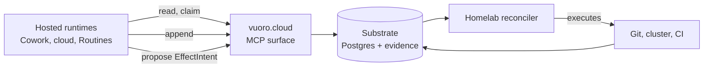
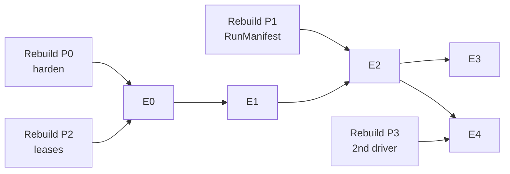

# Vuoro at the Edge

**Status:** Plan of record for the edge work.
**Written:** 2026-09-19
**Landed:** 2026-09-20, from the session that picked up the extended realignment. Previously existed only in `~/Downloads` and in a chat artifact; this landing is the durable record. A companion first-principles rebuild (R1-R13, ADR-01..08, Phase 0-6) has since landed as `docs/plans/2026-09-19-agentic-pipeline-first-principles-rebuild.md` (merge d47b98cb); its headings are unnumbered, so there is no §15 to cite — the verdict this doc reverses is its build-versus-buy ledger row for vuoro.cloud.
**Decides:** DECISION 1 (operator, 2026-09-20) — both paths, public E1 first. Recorded below at "Decisions left open" item 1, now marked decided.

2026-09-19 · @Someone

Extending vuoro.cloud so the substrate reaches runtimes you do not host — a companion to the first-principles rebuild.

## The reframe

vuoro.cloud is not a hosted product looking for users. It is the substrate's network-reachable edge, and its justification is that a growing share of your agent sessions now run in places your homelab cannot see.

That distinction matters because it survives your own position. Pursuing external users adds nothing; reaching external *runtimes* is a different claim entirely, and it is an availability requirement rather than a market one. A Cowork session, a scheduled cloud run or a Codex task today produces no Claim, no RunManifest and no evidence — not because the design excludes them, but because they cannot reach a Postgres on VLAN 20. That is a hole in the record, which makes it a defect against R5 and R8 of the rebuild.

**This reverses the "park vuoro.cloud" verdict recorded in the rebuild's Build-vs-buy ledger** (`docs/plans/2026-09-19-agentic-pipeline-first-principles-rebuild.md`, row "**Revisit**. superseded — see the companion doc Vuoro at the Edge"; its open question "Does vuoro.cloud stay up?" is the same verdict). That verdict was correct given the premise that the hosted variant served nobody. The premise was wrong: it serves every runtime you do not host, which is most of them now.

### One finding changes the economics

In Anthropic's products, MCP connector calls are made **server-side by Anthropic's infrastructure, not from the agent's sandbox**. Authorization tokens never enter the sandbox, and the sandbox's egress allowlist does not apply to MCP traffic at all ([Cowork architecture](https://support.claude.com/en/articles/14479288-claude-cowork-architecture-overview), [cloud environments](https://code.claude.com/docs/en/cloud-environments#network-access)).

Three consequences:

1. **One connector registration reaches every Anthropic surface** — claude.ai, Desktop, mobile, Cowork, Claude Code cloud sessions, Routines. You are not integrating five times.
2. **The sandbox egress regressions are irrelevant** to this path. Calling your API with `curl` from inside a sandbox is fragile; calling it as a connector is not.
3. **What your server must be reachable from is Anthropic's egress, not the sandbox.** Public DNS, valid TLS, no IP allowlisting to your home network.

### What this document settles

Four things, in the order they bind: what each runtime can actually do (§2), where the boundary sits (§3), how the substrate is published (§4–5), and what it costs in threat-model terms (§8). One item — quota portfolio routing — came out materially weaker than it looked, and §6 says why.

## Runtime inventory

The reachable set is narrower than the enthusiasm suggests. Roughly half the hosted coding-agent market cannot talk to an arbitrary self-hosted MCP server at all.

| Runtime | Reaches your server? | Auth | Notes |
| --- | --- | --- | --- |
| claude.ai, Desktop, mobile | Yes | OAuth (CIMD / DCR / own client) or request headers | One [custom connector](https://support.claude.com/en/articles/11175166-get-started-with-custom-connectors-using-remote-mcp) registration; Pro and Max add their own |
| Cowork | Yes | Inherits the connector | Cloud sandbox; connector calls server-side |
| Cowork scheduled tasks | Yes, with a caveat | Inherits | Same capabilities as normal tasks — but see the bug below |
| Claude Code cloud sessions | Yes | Host passes connectors, OAuth pre-authenticated | Research preview; Pro, Max, Team, Enterprise |
| [Routines](https://code.claude.com/docs/en/routines) | Yes | Inherits, **no per-tool approval** | Scheduled or API-triggered; min interval 1 hour |
| [Managed Agents](https://platform.claude.com/docs/en/managed-agents/mcp-connector) | Yes | `static_bearer` or `mcp_oauth` via pre-registered vaults | Max 20 servers per agent; self-hosted sandbox option |
| OpenAI Responses API | Yes | Bearer in the `authorization` field | Cleanest OpenAI path; no plan gating |
| ChatGPT developer mode | Yes, gated | OAuth/OIDC, CIMD or DCR | Writes are **Business/Enterprise/Edu only**; Pro gets read/fetch |
| Cursor cloud agents | Yes | Per-user OAuth; credentials never enter the agent VM | HTTP transport only, no SSE |
| **Codex cloud tasks** | **No documented support** | — | MCP docs scope to CLI and IDE only; agent-phase internet blocked by default |
| **Google Jules** | **No** | — | Curated server list, explicit security decision |
| **Devin** | Marketplace only | — | Arbitrary custom servers unconfirmed |

### Four constraints that shape the design

**Sessions expire while waiting for you.** A Claude Code cloud session counts as inactive while it waits for an MCP tool approval or a sign-in, and can expire during that wait. Every tool must be non-interactive and fast; long work returns a handle and is polled.

**Scheduled tasks may start without their connectors.** Multiple reports say MCP connectors are not loaded into a scheduled-task session until a human sends a message, and that editing a scheduled task disables connectors on existing ones ([#43397](https://github.com/anthropics/claude-code/issues/43397), [#40835](https://github.com/anthropics/claude-code/issues/40835)). I found no Anthropic confirmation of a fix. Design for it: idempotent operations, prompts that verify tool availability before acting, and a documented delegate-to-subagent workaround.

**Anthropic's clients were still on the pre-2026-07-28 protocol.** A third-party matrix dated July 2026 and an independent server operator both report Claude clients still opening with `initialize` while Codex already spoke the new revision. Support both eras; re-check before dropping the old one.

**Your server may not need to be public at all.** The Managed Agents [self-hosted sandbox](https://platform.claude.com/docs/en/managed-agents/self-hosted-sandboxes) runs a worker on your own Linux host that polls Anthropic's queue and executes tools locally — including wrapping an internal MCP server as custom tools against `http://mcp.internal:8000/mcp`. Orchestration and the model stay on Anthropic's control plane, and tool inputs and outputs still flow to Anthropic, but the endpoint never leaves your network. §8 weighs this against exposure.

## The boundary

Intent, coordination and evidence cross to the cloud. Effects and credentials do not. That single rule decides every other question in this document, and it is the git→cluster split you already trust, wearing a different coat.

**What crosses.** Reading a WorkRelease and its acceptance criteria. Claiming one under a lease. Appending evidence. Writing a session note. Proposing an EffectIntent — a described change, not an applied one.

**What never crosses.** Cluster credentials. Merge rights. Any token that can write to the cluster, the registry or the forge's protected branches. A hosted runtime's maximum achievable outcome is an unmergeable branch and a queued intent.

**Why this is defensible rather than merely convenient.** You already accept that an agent with a worktree and no cluster credential is safe, because Flux verifies the commit signature before reconciling and the bot identity cannot merge. The cloud case adds only one thing: the agent is now somewhere you cannot inspect. That changes the attestation story, not the containment story — the blast radius was already bounded by the same mechanism.

**The asymmetry is deliberate and should stay.** It would be easy to let a cloud session hold a short-lived cluster credential brokered from OpenBao, and the mechanism exists. Don't. A hosted runtime is an unattested workload running in someone else's sandbox, reading untrusted repository content, with a credential to your substrate. That is two legs of the trifecta already; the third is exactly what this rule withholds.

**One practical consequence.** Every tool on the MCP surface must be classifiable as read, coordinate, record or propose. If a tool cannot be put in one of those four buckets, it belongs on the homelab side of the boundary, not on the published surface. That is a cheap and durable test to apply when the surface grows.

## MCP surface design

The 2026-07-28 spec wants exactly the object model you already have, which is the most useful coincidence in this document. Sessions were removed at every layer; cross-call state is now carried by **server-minted opaque handles passed as ordinary tool arguments** ([SEP-2567](https://github.com/modelcontextprotocol/modelcontextprotocol/blob/main/seps/2567-sessionless-mcp.md)).

A leased Claim *is* that handle. The canonical example in the SEP is a basket id threaded through add-item and checkout; yours is a lease id threaded through append-evidence and complete.

### The surface

| Tool | Bucket | Returns |
| --- | --- | --- |
| `list_ready_work` | read | WorkReleases whose dependencies are satisfied |
| `describe_work` | read | Acceptance criteria, provenance edges, prior attempts |
| `claim_work` | coordinate | `lease_id`, deadline, RunManifest id |
| `heartbeat` | coordinate | Extended deadline, or a lost-lease error |
| `append_evidence` | record | Chain position |
| `write_session_note` | record | Note revision |
| `propose_effect` | propose | EffectIntent id, queued for the homelab reconciler |
| `complete_work` | coordinate | Accepted, or the failing criterion |

**Possession is not authorization.** The SEP is explicit: validate `(handle, auth_context)` on every call, treat handles like document ids rather than session tokens, and make them unguessable. For a leased claim that is not a formality — it is what stops a replayed `complete_work` from a stale runtime.

**Lease TTL and idempotency stop being optional.** Cloud sessions expire mid-wait, scheduled tasks may start without connectors, and streams are no longer resumable — a broken stream means the client re-issues with a new request id. Every tool must be safe to call twice, and the lease must reclaim itself when the runtime simply vanishes. This is ADR-02 of the rebuild, now with an external forcing function.

**Document durability in the tool description.** The spec asks servers to state lifetime in the description so the model can reason about whether to create state — "leases expire after 30 minutes without a heartbeat" belongs in the text the model reads, not only in your schema.

### What compliance actually costs

A minimal server in September 2026: one HTTPS POST endpoint, `405` on GET and DELETE, `Origin` validation; header-to-body agreement checks on `MCP-Protocol-Version`, `Mcp-Method` and `Mcp-Name`, rejecting mismatches with `-32020`; `server/discover` implemented (servers MUST); `resultType` on every result; `ttlMs` and `cacheScope` on every list and read result; deterministic tool ordering for prompt-cache hit rates. Stateless handlers throughout — which is now a feature, since any instance can serve any request.

**And keep the legacy path alive.** Your primary consumers are Anthropic clients, and they were still opening with `initialize` as of mid-2026. Dual-era support is the migration cost, and it is the whole of it.

One reverse-proxy gotcha worth pre-empting: buffering breaks streaming. Send `X-Accel-Buffering: no`, tune read timeouts, and emit SSE keep-alive comments on long-lived listen streams.

## Auth and the grant model

Start with a static bearer token, and design the schema as if it were OAuth. That is the honest recommendation: for one operator, standing up an authorization server buys identity you already know, while the token *scoping* — which is where the design content lives — works identically either way.

**What the shortcut costs.** Anthropic's connector dialog supports request headers with up to four fixed credentials, and OpenAI's Responses API takes a bearer in the `authorization` field. Both cover the static path. Two caveats: header auth in Claude connectors is beta and limited to a subset of organizations, and **connector auth settings are immutable after adding** — changing them means removing and re-adding the connector. Pick the mode deliberately the first time.

**What the full path requires**, when you outgrow the shortcut:

- Serve `/.well-known/oauth-protected-resource` (RFC 9728) — MCP servers MUST implement it — and return `401` with `WWW-Authenticate` carrying `resource_metadata` and `scope`.
- Your authorization server implements OAuth 2.1 with PKCE, plus RFC 8414 metadata or OIDC Discovery.
- **Validate the token audience is you.** Clients send RFC 8707 `resource=<your canonical URI>` unconditionally; servers MUST reject tokens minted for anyone else and MUST NOT pass them onward.
- Advertise `client_id_metadata_document_supported`. CIMD is the recommended path and the only one whose client identity is portable across authorization servers — DCR is deprecated, and pre-registered credentials must be keyed by issuer.
- Use `403` with `error="insufficient_scope"` for step-up, emitting every needed scope in one challenge.

Skip Enterprise Managed Authorization entirely. It centralizes access through an IdP for organizations, which you are not.

### EffectGrant as scope

This is where the cloud extension forces a clarification the local path lets you fudge. Locally, a grant is a row the dispatcher consults. Over MCP it has to be a property of the credential, because the caller is unattested and the server is stateless.

The shape: a grant class is a scope, and a grant instance is a lease-bound handle. `vuoro:work.read` and `vuoro:work.claim` are scopes. The specific WorkRelease a session may act on, and the resources its EffectIntent may name, are bound to the `lease_id` — not to the token. So a leaked token gets you the *class* of access, and a leaked handle gets you one expiring claim; neither alone gets you both, and the audience check stops either from being replayed elsewhere.

**The property worth stating plainly:** no credential issued to a hosted runtime can name a cluster resource. Scopes cover read, claim, record and propose. There is no `vuoro:effect.apply` scope, because §3 says applying happens on the other side of the boundary. Leaving that scope undefined is a design decision, not an omission — write it down so a future session does not helpfully add it.

## Quota portfolio routing

This came out materially weaker than it looked, and the reason is worth stating up front: **there is no supported programmatic read of individual plan consumption, on either vendor.** Predictive routing — "send this to whichever pool has headroom" — cannot be built on published interfaces today.

What exists, precisely:

| Signal | Where | Useful for |
| --- | --- | --- |
| `/usage` screen | Claude Code, interactive | Human inspection; attributes usage by skill, subagent, plugin and individual MCP server |
| `rate_limit_event` | `--output-format stream-json` | Status only — allowed/denied, reset time, overage. **No percentages** |
| OTel metrics | Any setup | Session, token, cost, commit, PR counts. **No quota gauge, no plan tier** |
| `/status` | Codex CLI, interactive | Remaining allowance, human-readable |
| [Analytics API](https://platform.claude.com/docs/en/manage-claude/claude-code-analytics-api) | Anthropic | Daily aggregation — **organization accounts only**, needs an Admin API key |
| Compliance API | OpenAI | Codex usage — **Enterprise only** |

`/api/oauth/usage` is what the UI calls. It is not intended for third-party use, rate-limits aggressively, and community tooling hitting it collects persistent 429s. Open requests for `claude usage --json` and for percentages in `rate_limit_event` are unresolved.

### What can actually be built

**Reactive, not predictive — and recorded, not routed.** A plan-level limit cannot be escaped by switching model; a model-family limit can. `rate_limit_event` tells you which you hit and when it resets. The substrate's part is the same in both cases: record the event as evidence, release the lease, park the claim, and let the scheduler refill when the window rolls. On a family limit the harness or the dispatcher picks another family and claims the parked WorkRelease again; the substrate records which family the next attempt used and never chooses it. That division is deliberate — model choice is the harness's, and a substrate that re-dispatched across families would be a model router. What it buys is still the whole point: your "unlogged cost/quota failover" friction fixed, because the failover already happens and it just needs to be an event in the evidence chain rather than an afternoon you lost.

**Self-instrumented consumption, as a second-best.** Your MCP server sees every claim and completion from every runtime. It is the one vantage point you control that spans them all. Reconstructing consumption from your own call log will be approximate, but it is the only cross-device, cross-runtime view available — and `/usage` already attributes a share per MCP server, which gives you a periodic calibration point.

**Portfolio value survives, on a weaker footing.** Re-claiming a parked WorkRelease from a different runtime when one pool is exhausted still works, because the trigger is a denial rather than a forecast — and because the deciding is done by whoever claims, not by the substrate that parked it. What you lose is the ability to *balance* load across pools before hitting a wall. That is a real loss and it is the reason this item dropped from first to third in the ordering.

**One intake path worth knowing.** Routines expose `POST /v1/claude_code/routines/{id}/fire` with a bearer token and the `experimental-cc-routine-2026-04-01` beta header. That is a clean way to push work from your substrate into a Claude cloud session from outside. Note the payload arrives wrapped in `<routine-fire-payload>` and is explicitly treated as untrusted — which is correct, and which your own EffectIntent handling should mirror.

## Cloud proposes, homelab executes

An EffectIntent is a described change with a named resource set, queued by a runtime that cannot apply it. A homelab-side reconciler — actionq-dispatcher, already trusted, already holding the credentials — picks it up and executes. The shape is deliberately the same as Flux reconciling a commit.

**Why a reconciler rather than a callback.** A callback needs the cloud runtime to be reachable and alive, and §2 established that it is frequently neither. A reconciler polls, which survives the runtime vanishing mid-task, and which puts retry semantics on the side of the boundary where you control them.

**What an EffectIntent carries.** The resource set it wants to touch, the change described in whatever form the reconciler can act on, the `lease_id` it was produced under, and the RunManifest of the session that produced it. That last field is what makes the executed change attributable back through a runtime you do not own, which is the whole point of the exercise.

**Three classes, in ascending order of caution:**

1. **Diff-shaped** — a branch and a proposed change. The reconciler pushes it; existing branch protection and signature verification apply unchanged. This should be the overwhelming majority.
2. **Declarative** — a change to a GitOps-managed resource. The reconciler expresses it as a commit to the appservice repo, which means it is still diff-shaped by the time anything reconciles it. Nothing bypasses Flux.
3. **Imperative** — something genuinely not expressible as a diff. Per ADR-05, this class should be *named explicitly* rather than assumed to exist. My read is that at homelab scale it is nearly empty, and that anything landing in it deserves a written justification rather than a mechanism.

**Signing.** The reconciler signs, not the cloud session — there is no way to attest an unattested runtime's authorship, and pretending otherwise would be exactly the overclaim §8 of the rebuild warns against. What you get instead is a verifiable chain from the signed commit back to a RunManifest that names the runtime, the model and the profile revision. That is weaker than cryptographic authorship and stronger than anything the market currently offers, and it is worth describing in exactly those terms.

**A deduplication property falls out.** Because an EffectIntent names its resource set before execution, a second identical intent from a re-run session is visible as a duplicate *before* anything happens. That is the fix for your cost-blind-reruns-of-live-infrastructure-commands friction, and it only works because the intent is declared rather than executed directly.

## Threat model change

Exposing vuoro.cloud converts a homelab-internal substrate into an internet-reachable, credential-holding service with one user and no on-call. That is a real change in kind, and Phase 0 of the rebuild stops being optional hygiene.

**What the exposure actually is.** A public HTTPS endpoint holding the authoritative record of what your agents are doing, reachable by vendor clouds whose egress ranges shift, authenticated by a credential that lives in a vendor's connector configuration. You cannot IP-allowlist it, you cannot use a self-signed certificate, and the callers are not you.

**The trifecta, with a substrate credential in play.** A hosted session reads untrusted repository content, holds a credential to your substrate, and has network egress. All three legs. The mitigation is not to remove a leg — you cannot — but to make the credential worth as little as possible: read, claim, record and propose scopes only, no effect scope, lease-bound handles, short TTLs, audience-validated tokens that cannot be replayed elsewhere. An attacker who fully compromises a session gets to make a mess of your work queue and propose intents you will see before they execute.

**What that leaves genuinely at risk.** Queue integrity — poisoned WorkReleases, false completions, evidence entries that lie. This is why hash chaining matters more once the cloud is in scope: the chain does not prevent a bad entry, but it makes tampering with the record afterwards detectable, and it distinguishes "an agent recorded something wrong" from "someone edited history".

### Phase 0, revised

| Control | Local-only | With cloud runtimes |
| --- | --- | --- |
| Evidence chaining | Good practice | Load-bearing |
| Lease expiry | Prevents deadlock | Prevents replay |
| Token audience validation | n/a | Mandatory — MCP servers MUST reject foreign tokens |
| Effect scope | Implicit | Explicitly undefined, and documented as such |
| Rate limiting on the surface | Unnecessary | Necessary — the callers are not you |
| Endpoint monitoring | Optional | The only way you learn something is wrong |

### The option that avoids all of this

The Managed Agents self-hosted worker (§2) wraps an internal MCP server as custom tools and never exposes an endpoint. Orchestration and the model stay on Anthropic's control plane; tool inputs and outputs still flow to Anthropic; but there is no public surface to attack and no shifting egress to accommodate.

The trade is coverage. That path reaches Managed Agents and the Messages API. It does not reach Cowork, claude.ai, mobile, Routines or anything on the OpenAI side, because MCP tunnels are explicitly unavailable as claude.ai connectors. So: if the value is "work from my phone in Cowork and have it land in the substrate", you need the public endpoint and the controls above. If the value is unattended scheduled work, the worker path is strictly safer and worth preferring.

**That is the real decision in this document**, and it is not obviously a one-or-the-other. Running both — a narrow public surface for interactive runtimes, a worker for unattended ones — is defensible, and costs one more component to maintain.

## Implementation sequence

Five phases, folded into the rebuild's own phasing rather than running beside it. Each is independently valuable; the first two are worth doing whether or not the rest happens.

**E0 — Harden first, and mean it.** Rebuild Phase 0 plus the revised column in §8: evidence chaining, lease expiry with heartbeat, rate limiting, endpoint monitoring. Do not expose anything until this is done. *Depends on: rebuild Phase 0, 2.*

**E1 — Read-only surface, static bearer.** `list_ready_work` and `describe_work` only, one token, dual-era protocol support. This is a day of work and it answers the real question: does querying the substrate from Cowork on a phone actually change how you work, or is it a demo? *Reversible: delete the connector.*

**E2 — Claims and evidence.** Add `claim_work`, `heartbeat`, `append_evidence`, `write_session_note`, `complete_work`. Lease handles, idempotency throughout, `(handle, auth_context)` validated on every call. At this point a cloud session becomes a first-class citizen of the record, which is the actual goal. *Depends on: E0, rebuild Phase 1.*

**E3 — EffectIntent and the reconciler.** `propose_effect` on the surface, actionq-dispatcher polling and executing on the homelab side. Diff-shaped intents only to begin with. *Depends on: E2.*

**E4 — Reactive quota failover, recorded.** Record `rate_limit_event` as evidence; on a denial, release the lease, park the claim, and record which model family the next attempt used. Choosing that family is the harness's or the dispatcher's act, not the substrate's — the substrate records and parks, it does not route. Last, because it needs RunManifest, leases and a second driver to mean anything. *Depends on: E2, rebuild Phase 3, 6.*

### Sequencing against the rebuild

**Stop condition worth agreeing in advance.** If E1 runs for a month and you have not once reached for the substrate from a hosted runtime, stop. The rest of this document is only worth building if the read surface proves the need, and E1 exists precisely to find that out cheaply.

**One thing deliberately absent.** No phase here adds runtimes for the sake of coverage. Codex cloud and Jules cannot reach an arbitrary server, and building toward them would be building toward a maybe. If that changes, E1's surface works unmodified.

## Open questions and bets

### Decisions left open

1. **Public surface, self-hosted worker, or both?** §8's real decision. Public reaches interactive runtimes including Cowork on a phone; the worker is strictly safer and reaches only Managed Agents and the Messages API.

   **Decided (operator, 2026-09-20):** both. The target state is a narrow public MCP surface for interactive runtimes (Cowork, claude.ai, mobile, Routines, cloud sessions, OpenAI Responses) *and* the Managed Agents self-hosted worker for unattended runs. It costs one more component and that is accepted. The E1 stop condition stands as the falsifier: if a month of E1 passes without the substrate being reached from a hosted runtime, the rest is not built.
2. **Static bearer or full OAuth?** Static is right for one operator and costs you the ability to distinguish callers. If you ever want per-runtime scopes rather than one shared credential, that is the moment to move.
3. **Does the connector immutability rule change the sequencing?** Connector auth settings cannot be edited after adding. If E1 registers with a static header and E2 wants OAuth, that is a remove-and-re-add. Possibly worth deciding the auth mode before E1 rather than after.

### Falsifiable bets

- **The read surface proves the need.** If a month of E1 passes without you reaching for it, the rest is unbuilt and the hypothesis is refuted cheaply.
- **Cloud sessions are a meaningful share of work.** If, after E2, fewer than one in ten claims come from a hosted runtime, the edge is serving a case that does not exist.
- **The boundary holds without pressure.** If within six months there is a concrete case that genuinely requires an effect scope, ADR-05's "name the class explicitly" clause was hiding a real gap rather than an empty one.
- **Reactive failover is enough.** If parked claims routinely sit long enough to matter, the missing predictive signal is a real constraint rather than an inconvenience, and the answer is spend rather than engineering.

### Flagged as unverified

The scheduled-task connector bugs have no Anthropic fix confirmation; issue #43397 was closed as duplicate in April 2026. The Anthropic client protocol-version matrix is third-party and dated July 2026 — re-check before dropping `initialize` support. Managed Agents and MCP tunnel pricing and tier gating are not stated in the docs. Codex cloud's lack of MCP support is inferred from documentation silence, not an explicit denial. Cursor cloud agent plan gating is unstated.

### Sources

Gathered 19 September 2026, primarily from vendor reference documentation, the MCP specification and SEPs, and linked issue trackers. Principal sources are linked inline. Where a capability is plan-gated, the tier is stated in §2; where a claim rests on documentation silence rather than a stated position, it is flagged above rather than asserted.
